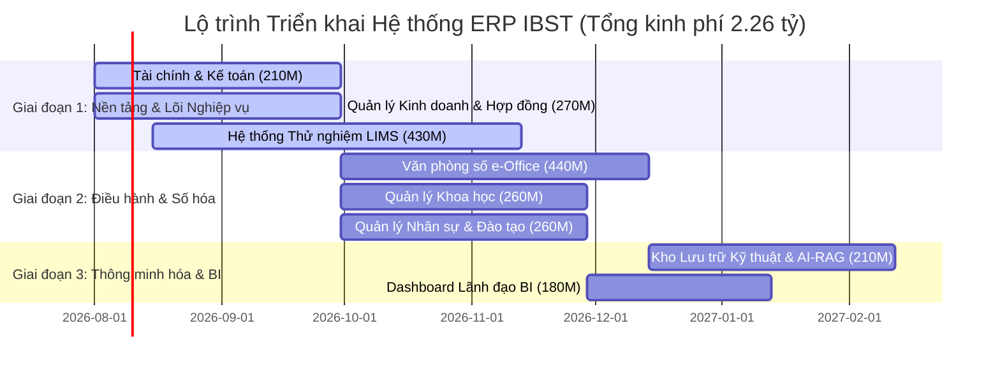

# BẢN ĐÁNH GIÁ CHI TIẾT & ĐỀ XUẤT ĐIỀU CHỈNH DỰ TOÁN HỆ THỐNG ERP IBST

> **Tài liệu tham chiếu gốc:** [tailieu-mota-tinhnang-erp-ibst.md](file:///d:/@Vibe_code_projects/IBST/tailieu-mota-tinhnang-erp-ibst.md)  
> **Tổng ngân sách giữ nguyên:** **2.260.000.000 VNĐ** (Hai tỷ hai trăm sáu mươi triệu đồng chẵn).

---

## 1. Nhận xét Tổng quan về Dự toán Gốc

Bảng dự toán hiện tại của hệ thống ERP IBST có ưu điểm là đã gom 15 phân hệ lẻ thành **8 Nhóm Phân hệ lớn**, giúp cấu trúc dự án gọn gàng và dễ thương thảo. Tuy nhiên, khi phân tích chi tiết dưới góc độ **Độ khó Kỹ thuật (Technical Complexity)**, **Khối lượng Lập trình (Effort)** và **Rủi ro Tích hợp (Integration Risk)**, dự toán gốc tồn tại một số điểm chưa thực sự cân đối:

### 🔴 Điểm chưa hợp lý / Rủi ro ở dự toán gốc:
1. **Phân hệ Tài chính, Kế toán & Dòng tiền (140M) bị định giá quá thấp:** Việc liên thông/tích hợp API với các phần mềm kế toán hiện hữu như MISA, Bravo và Bank API, xử lý đối soát số dư thời gian thực và cảnh báo dòng tiền âm across 16 đơn vị là bài toán rất phức tạp về mặt tích hợp và bảo mật.
2. **Phân hệ Kho lưu trữ Hồ sơ Kỹ thuật (140M) chưa bao gồm chi phí Trợ lý AI-RAG:** Trong Mục 3 của tài liệu có mô tả tính năng **AI-RAG tra cứu văn bản quy chuẩn xây dựng QCVN**, nhưng ở Mục 1 chưa có ngân sách riêng cho mô hình AI/Vector DB này. Ngoài ra, việc xử lý file dung lượng lớn (CAD/BIM) và phân quyền RLS đến từng folder/file đòi hỏi nhiều công sức lập trình hơn mức 140M.
3. **Phân hệ Dashboard Lãnh đạo (230M) bị định giá hơi cao:** Dashboard chủ yếu đóng vai trò "tiêu thụ dữ liệu" (Data Consumer). Nếu dữ liệu từ 7 phân hệ còn lại đã được chuẩn hóa vào Database, việc dựng Chart và UI Dashboard không tốn đến 230M.
4. **Phân hệ LIMS & Thiết bị Lab (400M) là trái tim nghiệp vụ của IBST nhưng cần đầu tư tương xứng hơn:** Xây dựng công cụ cấu hình biểu mẫu động kiểu Excel (Dynamic Formula Engine), ký số CA tự động trên PDF và quản lý 11 phòng LAS-XD đòi hỏi khối lượng kiểm thử thực địa rất lớn.

---

## 2. Bảng So sánh & Đề xuất Điều chỉnh Dự toán Chi tiết

Dưới đây là bảng tái phân bổ dự toán nhằm tối ưu hóa chi phí dựa trên khối lượng công việc thực tế, đảm bảo **Tổng dự toán giữ nguyên 2.260.000.000 VNĐ**:

| STT | Tên Nhóm Phân hệ | Dự toán Gốc (VNĐ) | Dự toán Đề xuất (VNĐ) | Chênh lệch | Đánh giá Mức độ Phức tạp & Rủi ro Triển khai |
| :---: | :--- | :---: | :---: | :---: | :--- |
| **1** | **Dashboard Tổng quan Giám sát & Điều hành** | 230.000.000 | **180.000.000** | 📉 -50M | **Trung bình.** Chủ yếu là lập trình UI Composed Chart & SQL Aggregation Views. Giảm ngân sách do phụ thuộc vào độ chuẩn hóa của dữ liệu đầu vào. |
| **2** | **Quản lý Kinh doanh, Hợp đồng & Khách hàng** | 290.000.000 | **270.000.000** | 📉 -20M | **Khá.** CRM + Quản lý hợp đồng + Công thức trích nộp nghĩa vụ 16 đơn vị. Nghiệp vụ rõ ràng, chủ yếu là xử lý logic tài chính. |
| **3** | **Quản lý Tài chính, Kế toán & Dòng tiền** | 140.000.000 | **210.000.000** | 📈 **+70M** | **Rất cao.** Tích hợp API ngân hàng & MISA/Bravo, xử lý bảo mật dòng tiền, tính số dư khả dụng thời gian thực. Cần tăng kinh phí để dự phòng rủi ro tích hợp hệ thống cũ. |
| **4** | **Quản lý Khoa học: Đề tài, SHTT & Chuyển giao** | 280.000.000 | **260.000.000** | 📉 -20M | **Trung bình - Khá.** Quản lý tiến độ đề tài KHCN các cấp, bản quyền, phân bổ hoa hồng. Logic Workflow & State Machine tiêu chuẩn. |
| **5** | **Quản lý Tổ chức Nhân sự, Đào tạo & Đảng - Đoàn** | 300.000.000 | **260.000.000** | 📉 -40M | **Trung bình.** Quản lý hồ sơ CBNV, chứng chỉ xây dựng, đào tạo Tiến sĩ (NCS) & Đảng/Đoàn. Khối lượng màn hình nhiều nhưng logic CRUD là chủ đạo. |
| **6** | **Hệ thống Thử nghiệm (LIMS), Thiết bị Lab & Đầu tư** | 400.000.000 | **430.000.000** | 📈 **+30M** | **Cực kỳ cao (Lõi nghiệp vụ).** Engine cấu hình biểu mẫu động Excel-like, ký số CA PDF, chuẩn ISO/IEC 17025 cho 11 phòng LAS-XD. Tăng kinh phí để đảm bảo chất lượng triển khai thực địa. |
| **7** | **Văn phòng số (e-Office): Văn bản, Lịch & Giao việc** | 480.000.000 | **440.000.000** | 📉 -40M | **Rất cao.** Liên thông Trục văn bản Bộ Xây dựng (SOAP/REST XML Thông tư 02), Workflow Engine động, ký số CA. Đỉnh chi phí nhưng điều chỉnh nhẹ để san sẻ cho Kế toán & AI-RAG. |
| **8** | **Kho Lưu trữ Số hóa Hồ sơ Kỹ thuật & Trợ lý AI-RAG** | 140.000.000 | **210.000.000** | 📈 **+70M** | **Cao (Tích hợp AI).** Quản lý CAD/BIM, phân quyền RLS thư mục + **Tích hợp Trợ lý Trí tuệ Nhân tạo AI-RAG** tra cứu văn bản quy chuẩn xây dựng QCVN (Embedding + Vector DB). |
| | **TỔNG CỘNG HỆ THỐNG** | **2.260.000.000** | **2.260.000.000** | **0 VNĐ** | *(Bằng chữ: Hai tỷ hai trăm sáu mươi triệu đồng chẵn./.)* |

---

## 3. Giải trình Chi tiết Lý do Điều chỉnh cho từng Phân hệ

### 1. Dashboard Lãnh đạo (Giảm 50M: 230M ➔ 180M)
* **Lý do điều chỉnh:** Dashboard BI về bản chất là giao diện hiển thị dữ liệu tổng hợp. Nếu 7 phân hệ nghiệp vụ bên dưới được thiết kế cơ sở dữ liệu chuẩn hóa (PostgreSQL Views, Materialized Views), công việc của phân hệ Dashboard chỉ bao gồm viết Query tổng hợp và dựng biểu đồ trên React (Sử dụng Recharts/Chart.js). 
* **Mức 180M** vẫn đảm bảo đủ công sức xây dựng thuật toán Unit Health Score và Dự báo dòng tiền.

### 2. Quản lý Kinh doanh & Hợp đồng (Giảm 20M: 290M ➔ 270M)
* **Lý do điều chỉnh:** Phân hệ này tập trung vào bài toán quản trị hợp đồng, theo dõi tiến độ thanh toán và trích nộp nghĩa vụ của 16 đơn vị. Các thuật toán này hoàn toàn nằm trong phạm vi xử lý Server-side logic chuẩn. Mức **270M** là rất hợp lý cho khối lượng lập trình này.

### 3. Quản lý Tài chính, Kế toán & Dòng tiền (Tăng 70M: 140M ➔ 210M)
* **Lý do điều chỉnh:** Đây là phân hệ có **rủi ro tích hợp kỹ thuật cao nhất**. Việc phải kết nối API hoặc đọc/ghi dữ liệu liên thông với phần mềm Kế toán bên thứ ba (MISA, Bravo) thường gặp nhiều vướng mắc về cấu trúc dữ liệu không đồng nhất, phiên bản legacy, và thủ tục bảo mật ngân hàng.
* **Mức 210M** giúp đảm bảo ngân sách cho việc nghiên cứu SDK/API của MISA/Bravo, xây dựng Data Pipeline đồng bộ và viết bộ kiểm tra đối soát dòng tiền tự động.

### 4. Quản lý Khoa học (Giảm 20M: 280M ➔ 260M)
* **Lý do điều chỉnh:** Nghiệp vụ quản lý đề tài KHCN và Bằng sáng chế mang tính đặc thù của Viện IBST, nhưng mặt kỹ thuật chủ yếu là quản lý trạng thái hồ sơ (State Machine: Nháp ➔ Duyệt thuyết minh ➔ Tạm ứng ➔ Nghiệm thu ➔ Thanh lý) và lưu trữ sản phẩm. Mức **260M** thỏa đáng cho các luồng phê duyệt này.

### 5. Quản lý Nhân sự, Đào tạo & Đoàn thể (Giảm 40M: 300M ➔ 260M)
* **Lý do điều chỉnh:** Mặc dù phân hệ này gộp cả 3 mảng (Nhân sự, Đào tạo Tiến sĩ NCS, Đảng/Đoàn), nhưng phần lớn là các màn hình Form nhập liệu, danh sách và báo cáo xuất file. Phần phức tạp nhất là cảnh báo hết hạn Chứng chỉ hành nghề và phân quyền RLS bảo mật thông tin lương/định danh. Mức **260M** hoàn toàn đáp ứng tốt.

### 6. Hệ thống Thử nghiệm LIMS & Lab (Tăng 30M: 400M ➔ 430M)
* **Lý do điều chỉnh:** Đây là **phân hệ mang lại giá trị cốt lõi và khác biệt nhất** cho IBST so với các đơn vị hành chính thông thường. 
  * Cần xây dựng **Dynamic Excel-like Formula Engine** để các phòng thí nghiệm tự định nghĩa công thức tính toán cơ lý phức tạp.
  * Tích hợp Chữ ký số CA điện tử trực tiếp lên tệp PDF Phiếu kết quả.
  * Triển khai và hướng dẫn người dùng tại **11 phòng LAS-XD** trên toàn quốc.
* **Mức 430M** thể hiện đúng vị thế "trái tim nghiệp vụ" của LIMS trong toàn bộ hệ thống ERP.

### 7. Văn phòng số e-Office (Giảm 40M: 480M ➔ 440M)
* **Lý do điều chỉnh:** Dự toán gốc 480M là khá lớn. Mặc dù công việc tích hợp **Trục văn bản Bộ Xây dựng** (Thông tư 02/2017/TT-VPCP mã hóa XML SOAP/REST) và xây dựng Workflow Engine phê duyệt động là rất nặng, nhưng mức **440M** vẫn là phân hệ được phân bổ ngân sách cao nhất toàn hệ thống, đủ để hoàn thành xuất sắc toàn bộ tính năng e-Office.

### 8. Kho Lưu trữ Kỹ thuật & Trợ lý AI-RAG (Tăng 70M: 140M ➔ 210M)
* **Lý do điều chỉnh:** 
  * Mức 140M cũ chỉ đủ cho việc quản lý lưu trữ File cơ bản và phân quyền thư mục RLS.
  * Bổ sung phạm vi ngân sách cho **Tính năng Trợ lý AI-RAG** (đã đề cập ở Mục 3 trong tài liệu gốc): Xây dựng Pipeline trích xuất nội dung văn bản quy chuẩn xây dựng (QCVN 06:2022, TCVN...), tạo Vector Embeddings, lưu trữ trên Vector Database và tích hợp LLM API để cán bộ tra cứu bằng tiếng Việt tự nhiên.
* **Mức 210M** giúp phân hệ này trở thành một "Kho tri thức thông minh" thực sự cho Viện IBST.

---

## 4. Bảng Đánh giá Mức độ Ưu tiên & Lộ trình Triển khai (Phân kỳ Đầu tư)

Để đảm bảo dự án vận hành mượt mà và giảm thiểu rủi ro triển khai, đề xuất phân kỳ triển khai 2.26 tỷ VNĐ theo 3 Giai đoạn:

### Chi tiết Phân kỳ:
1. **Giai đoạn 1 (Tháng 1 - Tháng 3): Nền tảng Dòng tiền & Lõi Thử nghiệm (910.000.000 VNĐ)**
   * Tập trung số hóa Dòng tiền (Kế toán), Hợp đồng khách hàng và Hệ thống LIMS (Phân hệ 2, 3, 6).
   * Giúp Viện kiểm soát ngay thu chi và chuẩn hóa 11 phòng LAS-XD.
2. **Giai đoạn 2 (Tháng 3 - Tháng 6): Điều hành Hành chính & Đào tạo (960.000.000 VNĐ)**
   * Triển khai e-Office, Liên thông Trục văn bản BXD, Quản lý Khoa học và Nhân sự (Phân hệ 4, 5, 7).
   * Đưa Viện vào trạng thái làm việc "Văn phòng không giấy tờ".
3. **Giai đoạn 3 (Tháng 6 - Tháng 8): Tích hợp AI-RAG & Dashboard Điều hành (390.000.000 VNĐ)**
   * Đưa Trợ lý AI-RAG tra cứu QCVN vào hoạt động và hoàn thiện Dashboard BI cho Viện trưởng (Phân hệ 1, 8).
   * Tổng hợp toàn bộ dữ liệu hệ thống lên trung tâm điều hành.

---

## 5. Khuyến nghị Kỹ thuật & Điều khoản Thương thảo cho IBST

1. **Về Tích hợp MISA / Bravo:** Trong Hợp đồng phát triển, cần quy định rõ trách nhiệm của IBST trong việc phối hợp cung cấp tài liệu API / CSDL của MISA/Bravo. Đơn vị phát triển phần mềm chịu trách nhiệm viết Connector đồng bộ.
2. **Về Chữ ký số (CA):** Cần xác định rõ IBST sử dụng Chữ ký số của Ban Cơ yếu Chính phủ hay CA Doanh nghiệp (Viettel CA, VNPT CA) để chuẩn hóa thư viện Ký số PDF Server-side.
3. **Về Trợ lý AI-RAG:** Đề xuất sử dụng mô hình AI mã nguồn mở (như Qwen-2.5 / Llama-3) chạy Local/Private Cloud hoặc gọi API OpenAI/Claude qua Proxy bảo mật để đảm bảo dữ liệu quy chuẩn kỹ thuật được bảo mật tuyệt đối.
