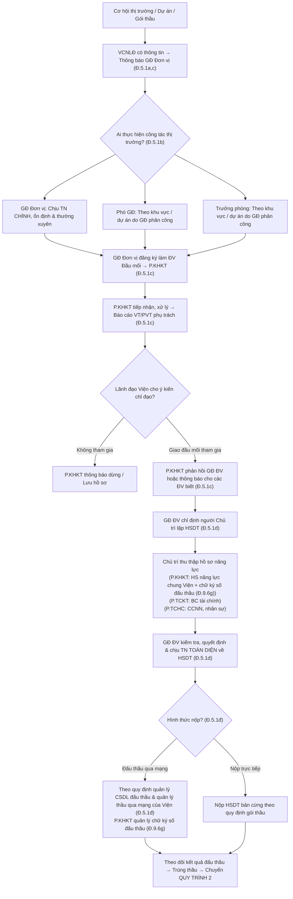
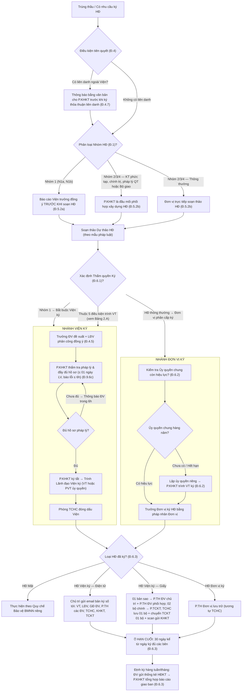
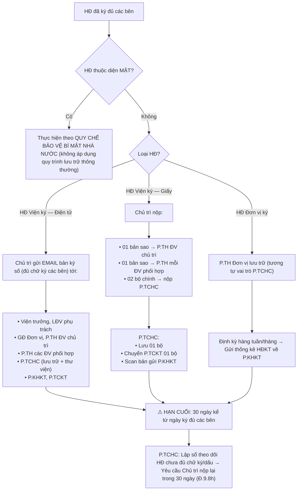
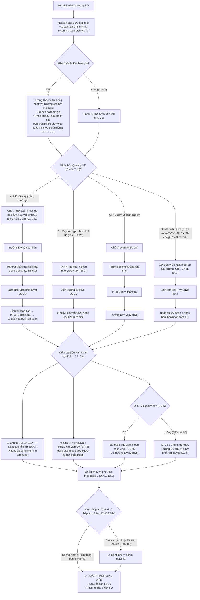
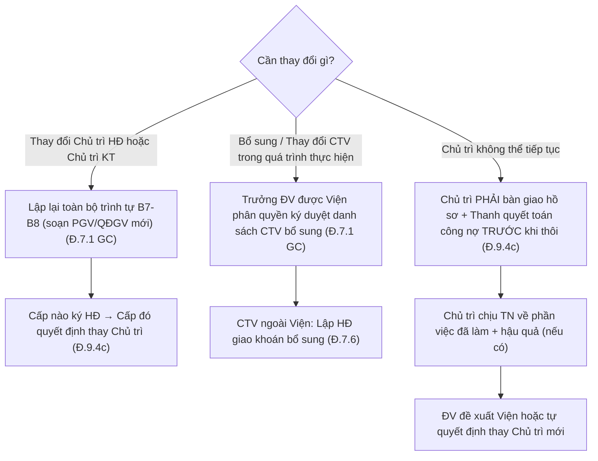
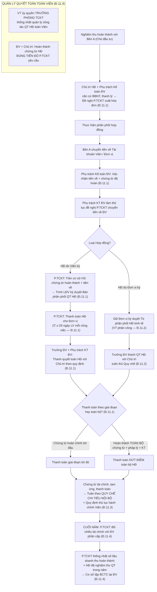
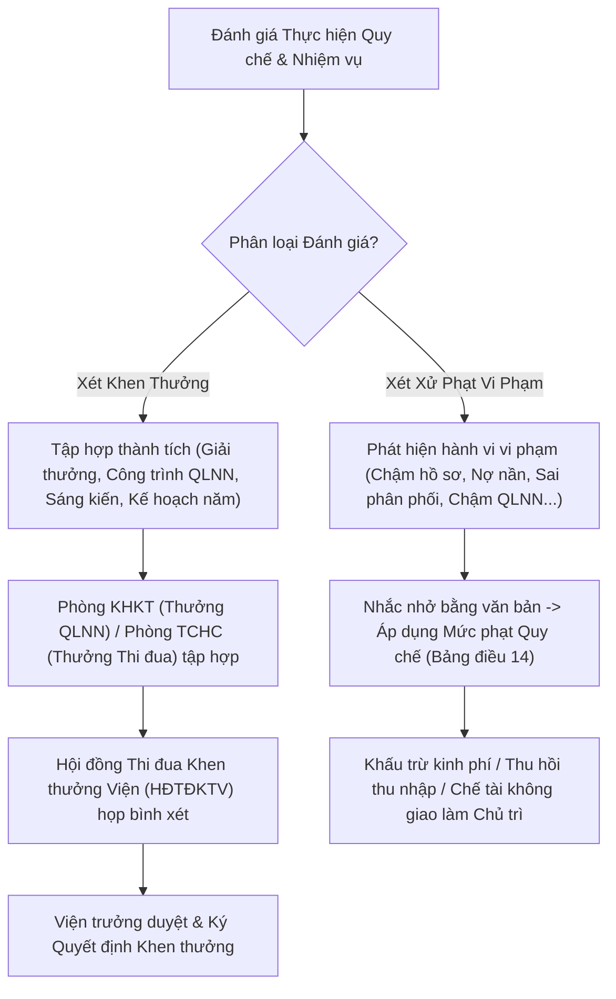

# HƯỚNG DẪN VÀ LƯU ĐỒ QUY TRÌNH THỰC HIỆN NHIỆM VỤ PHỤC VỤ QUẢN LÝ NHÀ NƯỚC VÀ DỊCH VỤ KỸ THUẬT
*(Ban hành kèm theo Quy chế 2815/QĐ-VKH ngày 01/12/2025 của Viện KHCN Xây dựng - Hiệu lực từ 01/01/2026)*

---

## I. TỔNG QUAN HỆ THỐNG QUY TRÌNH & MA TRẬN TRÁCH NHIỆM (RACI)

### 1. Phân nhóm Nhiệm vụ & Hợp đồng (Điều 1)
* **Nhóm 1 (PVQLNN):**
  * **N1a:** Giám định, kiểm định sự cố theo yêu cầu của cơ quan chức năng (tư pháp, cơ quan quản lý...).
  * **N1b:** Nhiệm vụ PVQLNN theo yêu cầu của Bộ/Ngành có kinh phí cấp trực tiếp.
* **Nhóm 2 (Tư vấn):**
  * **N2a:** TVQLDA, TV đầu tư XD, Chuyển giao công nghệ.
  * **N2b:** Chứng nhận HCHQ, Hiệu chuẩn thiết bị.
  * **N2c:** Tập huấn, Đào tạo.
  * **N2d:** Khảo sát XD, Kiểm định CLCT, Quan trắc, Trắc đạc, Thí nghiệm hiện trường.
  * **N2e:** Thí nghiệm VL tại phòng TN hiện trường, Thí nghiệm cấu kiện trong phòng.
  * **N2f:** Thí nghiệm VL trong phòng (đất, thép, mối hàn, thành phần hóa học...).
  * **N2g:** Thí nghiệm đặc thù (chịu lửa, hệ bao che, ống thổi khí động, động đất).
* **Nhóm 3:** Thi công xây dựng.
* **Nhóm 4:** Cung ứng vật tư, máy móc, thiết bị.

---

### 2. Ma trận Phân công Trách nhiệm RACI (Điều 4)

| Chủ thể / Bộ phận | Vai trò chính trong hệ thống quy trình | Trách nhiệm chính (RACI) |
| :--- | :--- | :--- |
| **Lãnh đạo Viện** | Phê duyệt tổng thể, phân cấp, chỉ đạo các HĐ trọng điểm | **A** (Accountable - Phê duyệt cuối cùng) |
| **Phòng KHKT** | Đầu mối thị trường, thầu, kiểm tra pháp lý HĐ, tổng hợp năng lực | **R/C** (Responsible/Consulted) |
| **Phòng TCKT** | Quản lý thu chi, xuất hóa đơn, phân phối doanh thu, nợ thuế | **R/C** (Responsible/Consulted) |
| **Phòng TCHC** | Quản lý nhân sự, lưu trữ văn thư, con dấu/chữ ký số, bảo hiểm | **R/C** (Responsible/Consulted) |
| **Giám đốc Đơn vị** | Quản lý toàn diện đơn vị, ký HĐ phân cấp, chịu trách nhiệm pháp lý/kỹ thuật | **R/A** (Responsible/Accountable tại đơn vị) |
| **Chủ trì Hợp đồng** | Quản lý trực tiếp tiến độ, chất lượng, chi phí, nhân sự thực hiện HĐ | **R** (Responsible - Người thực hiện trực tiếp) |
| **Phòng Tổng hợp (Đơn vị)** | Thẩm tra nội bộ tại đơn vị (KHKT - TCKT - TCHC cấp đơn vị) | **C/I** (Consulted/Informed) |

> **Ghi chú RACI:**
> - **R (Responsible):** Trực tiếp thực hiện công việc.
> - **A (Accountable):** Chịu trách nhiệm giải trình & phê duyệt cuối cùng.
> - **C (Consulted):** Được tham vấn ý kiến chuyên môn.
> - **I (Informed):** Nhận thông tin báo cáo.

---

## II. LƯU ĐỒ CHI TIẾT TỪNG QUY TRÌNH

---

### QUY TRÌNH 1: TÌM KIẾM THỊ TRƯỜNG VÀ LẬP HỒ SƠ DỰ THẦU (Điều 5.1, 9.6g)

#### 1.1. Lưu đồ Tổng thể Quy trình 1 (Flowchart)

#### 1.2. Ma trận Phân công Vai trò Công tác Thị trường (Điều 5.1b)

| Chức danh | Trách nhiệm thị trường | Phạm vi | Ghi chú |
| :--- | :--- | :--- | :--- |
| **Giám đốc Đơn vị** | Chịu trách nhiệm **CHÍNH** | Toàn bộ hoạt động thị trường, tìm kiếm việc làm ổn định, thường xuyên | Đ.5.1b |
| **Phó Giám đốc** | Thực hiện theo phân công GĐ | Theo **khu vực** hoặc **dự án cụ thể** | Đ.5.1b |
| **Trưởng phòng thuộc ĐV** | Thực hiện theo phân công GĐ | Theo **khu vực** hoặc **dự án cụ thể** | Đ.5.1b |
| **VCNLĐ** | Cung cấp thông tin cơ hội | Mọi thông tin liên quan CT/DA | Được xét khen thưởng (Đ.5.1a) |

#### 1.3. Bảng Tổng hợp Bước thực hiện Quy trình 1 — Chi tiết

| Bước | Tên bước công việc | Người / Đơn vị thực hiện | Điều kiện / Thời hạn | Sản phẩm đầu ra | Điều khoản |
| :---: | :--- | :--- | :--- | :--- | :---: |
| **B1** | Khai thác thông tin dự án | VCNLĐ / PGĐ / Trưởng phòng | Ngay khi có thông tin | Phiếu thông tin dự án / Email thông báo | Đ.5.1a,b |
| **B2** | Thông báo GĐ ĐV + Đăng ký đầu mối | VCNLĐ → GĐ ĐV → P.KHKT | Trước khi phát hành HSMT | Văn bản/Email đăng ký đầu mối | Đ.5.1c |
| **B3** | P.KHKT tổng hợp + Báo cáo LĐV | P.KHKT | Trong ngày làm việc | Tờ trình xin ý kiến VT/PVT | Đ.5.1c |
| **B4** | LĐV cho ý kiến → KHKT phản hồi | LĐV → P.KHKT → GĐ ĐV / các ĐV | Ngay sau khi LĐV duyệt | Thông báo giao/không giao đầu mối | Đ.5.1c |
| **B5** | GĐ ĐV chỉ định Chủ trì lập HSDT | Giám đốc Đơn vị | Ngay sau khi nhận phân công | QĐ chỉ định Chủ trì đấu thầu | Đ.5.1d |
| **B6** | Thu thập hồ sơ năng lực + CCNN | Chủ trì + P.KHKT + P.TCKT + P.TCHC | Theo tiến độ HSMT | HS năng lực chung Viện, BC tài chính, CCNN | Đ.5.1d, 9.6g |
| **B7** | GĐ kiểm tra, quyết định & duyệt HSDT | **Giám đốc Đơn vị** (chịu TN toàn diện) | Trước thời điểm đóng thầu | HSDT hoàn chỉnh đã ký duyệt / ký số | Đ.5.1d |
| **B8** | Nộp HSDT (Qua mạng hoặc trực tiếp) | Đơn vị chủ trì | Trước thời điểm đóng thầu | Xác nhận nộp HSDT thành công | Đ.5.1đ |
| **B9** | Theo dõi kết quả + Chuyển sang QT2 nếu trúng | Đơn vị + P.KHKT | Sau khi có kết quả | Thông báo trúng thầu / Không trúng | — |

#### 1.4. Giải thích & Ghi chú Quan trọng Quy trình 1

> [!TIP]
> **Khuyến khích thị trường (Đ.5.1a):** Viện khuyến khích MỌI VCNLĐ tìm kiếm việc làm. Cá nhân cung cấp thông tin dẫn đến ký HĐ được xét **khen thưởng** theo quy chế nội bộ đơn vị.

- **Tránh chồng chéo đầu mối (Đ.5.1c):** Việc đăng ký qua P.KHKT giúp Viện điều phối, tránh nhiều ĐV trong Viện cùng cạnh tranh 1 gói thầu.

- **Phòng KHKT — Vai trò trung tâm trong đấu thầu (Đ.9.6g):**
  - Quản lý **chữ ký số** trong lĩnh vực đấu thầu + lưu giữ hồ sơ ký số.
  - Là đầu mối **tổng hợp, soạn thảo, cung cấp hồ sơ năng lực chung** của Viện phục vụ đấu thầu.
  - Tiếp nhận đăng ký đầu mối, phản hồi kết quả chỉ đạo LĐV.

- **Đấu thầu qua mạng (Đ.5.1đ):** Quy trình thực hiện HSDT theo quy định riêng về quản lý, khai thác sử dụng CSDL phục vụ đấu thầu HĐKT và quản lý thầu qua mạng của Viện KHCNXD.

- **Trách nhiệm toàn diện của GĐ ĐV (Đ.5.1d):** GĐ Đơn vị **kiểm tra, quyết định và chịu trách nhiệm TOÀN DIỆN** về hồ sơ dự thầu — không chỉ phê duyệt hình thức.

---

### QUY TRÌNH 2: XÂY DỰNG VÀ KÝ KẾT HỢP ĐỒNG KINH TẾ (Điều 4.5, 4.7, 5.2, 6.1, 6.2, 6.3)

#### 2.1. Lưu đồ Tổng thể Quy trình 2 (Flowchart)

#### 2.A. Bảng 5 Điều kiện Bắt buộc Trình Viện trưởng Trước khi Ký (Điều 6.1)

| # | Điều kiện | Ngưỡng giá trị | Cấp ký bắt buộc |
| :---: | :--- | :---: | :--- |
| **1** | Tất cả HĐ Nhóm 1 (N1a giám định sự cố, N1b PVQLNN) | Mọi giá trị | **Viện trưởng** hoặc PVT ủy quyền |
| **2** | HĐ có kỹ thuật phức tạp, tính chính trị, pháp lý quan trọng | Mọi giá trị | **Viện trưởng** chỉ đạo |
| **3** | Kiểm định, đánh giá hiện trạng (thuộc N1a/N2d) | $\ge 2{,}0$ tỷ VNĐ | **Viện trưởng** chỉ đạo |
| **4** | Tất cả HĐ Tư vấn (Nhóm 2) | $\ge 5{,}0$ tỷ VNĐ | **Viện trưởng** chỉ đạo |
| **5** | HĐ Thi công (Nhóm 3) | $\ge 10{,}0$ tỷ VNĐ | **Viện trưởng** chỉ đạo |

> [!IMPORTANT]
> **Nguyên tắc "Viện ký phải có đề xuất" (Điều 4.5):** Trường hợp Viện ký HĐ (không phải phân cấp cho ĐV) thì **bắt buộc** phải có đề xuất bằng văn bản của Trưởng đơn vị **VÀ** được sự đồng ý của Lãnh đạo Viện phân công chỉ đạo.

#### 2.2. Bảng Tổng hợp Bước thực hiện Quy trình 2 — Chi tiết

| Bước | Tên bước công việc | Người / Đơn vị thực hiện | Điều kiện / Thời hạn | Sản phẩm đầu ra | Điều khoản |
| :---: | :--- | :--- | :--- | :--- | :---: |
| **B1** | Kiểm tra điều kiện tiên quyết: Có liên danh ngoài Viện? | Đơn vị chủ trì | Trước khi ký thỏa thuận liên danh | Văn bản thông báo P.KHKT | Đ.4.7 |
| **B2** | Phân loại Nhóm HĐ (N1a–N4) | Đơn vị / P.KHKT | Căn cứ Điều 1 + Bảng 1 | Xác định Nhóm + Loại HĐKT | Đ.1 |
| **B3** | Xin ý kiến Viện trưởng (nếu thuộc 5 điều kiện Bảng 2.A) | Trưởng ĐV → Viện trưởng | Trước khi soạn HĐ (Nhóm 1) hoặc trước khi ký (Nhóm 2-4 vượt ngưỡng) | Tờ trình / Phiếu trình ký HĐ có ý kiến VT | Đ.5.2a, 6.1 |
| **B4** | Soạn thảo Dự thảo HĐ | **P.KHKT** (HĐ phức tạp/Bộ giao) hoặc **Đơn vị** (HĐ thông thường) | Theo mẫu pháp luật hiện hành | Dự thảo HĐKT hoàn chỉnh | Đ.5.2b |
| **B5** | Kiểm tra Ủy quyền ký (HĐ Đơn vị ký) | P.KHKT | Ủy quyền chung hàng năm hoặc ủy quyền riêng cho HĐ/Dự án cụ thể | Văn bản ủy quyền còn hiệu lực | Đ.6.2 |
| **B6** | Thẩm tra pháp lý HĐ (HĐ Viện ký) | P.KHKT | **≤ 01 ngày LV** kể từ khi nhận đủ hồ sơ; **thông báo lỗi ≤ 6h** nếu chưa đủ | Ký tắt xác nhận đầy đủ trên Dự thảo HĐ | Đ.9.6c |
| **B7** | Đề xuất Viện ký (nếu ĐV yêu cầu) | Trưởng ĐV + LĐV phân công | Phải có văn bản đề xuất + đồng ý LĐV | Đề xuất + phê duyệt bằng văn bản | Đ.4.5 |
| **B8** | Ký kết Hợp đồng | **VT/PVT** (HĐ Viện ký) hoặc **GĐ Đơn vị** (HĐ ĐV ký theo phân cấp) | Sau khi đủ thẩm tra + ủy quyền + phê duyệt VT (nếu cần) | HĐKT đã ký & đóng dấu / ký số đầy đủ | Đ.6.1 |
| **B9a** | Phân phối HĐ (HĐ Viện ký — **Điện tử**) | Chủ trì HĐ | Ngay sau khi ký đủ các bên | Email bản ký số → VT, LĐV, GĐ ĐV, P.TH (ĐV chủ trì + ĐV phối hợp), TCHC, KHKT, TCKT | Đ.6.3 |
| **B9b** | Phân phối HĐ (HĐ Viện ký — **Giấy**) | Chủ trì HĐ → TCHC | Ngay sau khi ký đủ các bên | 01 sao → P.TH ĐV chủ trì + P.TH ĐV phối hợp; 02 bộ chính → TCKT; TCHC lưu 01 bộ + chuyển TCKT 01 bộ + bản scan → KHKT | Đ.6.3 |
| **B9c** | Phân phối HĐ (HĐ **Đơn vị** ký) | P.TH Đơn vị | Tương tự vai trò TCHC | P.TH lưu trữ; gửi thống kê về KHKT định kỳ tuần/tháng | Đ.6.3 |
| **B10** | **Hạn cuối lưu nộp HĐ chính thức** | Chủ trì HĐ | **≤ 30 ngày** kể từ ngày ký đủ các bên | HĐ đã chuyển lưu đầy đủ tới các bên nhận | Đ.6.3 |
| **B11** | Gửi thống kê HĐKT định kỳ | P.TH Đơn vị → P.KHKT | Hàng **tuần / tháng** | Bảng thống kê HĐKT theo mẫu (tổng hợp báo cáo giao ban Viện) | Đ.6.3 |

#### 2.3. Ma trận Thẩm quyền Ký Hợp đồng (Điều 4.2, 6.1, 6.2)

| Loại HĐ | Cấp ký mặc định | Cấp ký khi vượt ngưỡng / thuộc diện đặc biệt | Cơ sở ủy quyền |
| :--- | :--- | :--- | :--- |
| **Nhóm 1** (N1a, N1b) | **Viện trưởng** | — (luôn bắt buộc VT/PVT ủy quyền ký) | Ủy quyền PVT theo lĩnh vực |
| **Nhóm 2** (N2a–N2g) — dưới ngưỡng | **GĐ Đơn vị** (pháp nhân ĐV) | VT chỉ đạo khi $\ge 5$ tỷ hoặc phức tạp | Ủy quyền chung hàng năm (Đ.6.2) |
| **Nhóm 3** — dưới ngưỡng | **GĐ Đơn vị** (pháp nhân ĐV) | VT chỉ đạo khi $\ge 10$ tỷ hoặc phức tạp | Ủy quyền chung hàng năm (Đ.6.2) |
| **Nhóm 4** — dưới ngưỡng | **GĐ Đơn vị** (pháp nhân ĐV) | Không có ngưỡng riêng, chỉ khi phức tạp | Ủy quyền chung hàng năm (Đ.6.2) |
| HĐ ĐV yêu cầu Viện ký (Nhóm 2-4) | **VT/PVT** | Giảm tỷ lệ giao khoán (GC6 Bảng 1) | Đề xuất ĐV + phê duyệt LĐV (Đ.4.5) |

#### 2.4. Quy trình Phân phối & Lưu trữ HĐ Chi tiết (Điều 6.3)

#### 2.5. Giải thích & Ghi chú Quan trọng Quy trình 2

> [!WARNING]
> **Điều 4.7 — Liên danh ngoài Viện:** Trước khi ký bất kỳ văn bản thỏa thuận liên danh nào với đơn vị NGOÀI Viện, Đơn vị **PHẢI thông báo bằng văn bản** cho Phòng KHKT. Vi phạm điều này sẽ bị xử lý theo Điều 14.

- **Ủy quyền ký (Điều 6.2):**
  - **Ủy quyền chung:** Phòng KHKT hàng năm làm thủ tục ký ủy quyền chung của Viện trưởng cho các Phó Viện trưởng và Trưởng đơn vị.
  - **Ủy quyền riêng:** Trường hợp HĐ/dự án cụ thể cần ủy quyền riêng, Đơn vị lập văn bản ủy quyền, P.KHKT trình Viện trưởng ký.

- **Phân biệt 3 cấp soạn thảo HĐ (Điều 5.2):**

| Nhóm HĐ | Ai chủ trì soạn thảo? | Ai phê duyệt trước khi soạn? |
| :--- | :--- | :--- |
| Nhóm 1 (mọi trường hợp) | Đơn vị (sau khi VT đồng ý) | **Viện trưởng đồng ý trước** |
| Nhóm 2/3/4 — phức tạp, chính trị, Bộ giao | **P.KHKT** là đầu mối phối hợp ĐV soạn | P.KHKT + LĐV chỉ đạo |
| Nhóm 2/3/4 — thông thường | **Đơn vị** trực tiếp soạn | Trưởng ĐV quyết định |

- **Giảm tỷ lệ giao khoán khi ĐV yêu cầu Viện ký (Ghi chú 6, Bảng 1):**
  - Nhóm 2: Giảm **0,5%** (Chủ trì giảm 0,3%; Đơn vị giảm 0,2%).
  - Nhóm 3, 4: Giảm **0,2%** (Chủ trì giảm 0,1%; Đơn vị giảm 0,1%).

- **Thời hạn quan trọng:**

| Mốc | Thời hạn | Quy định |
| :--- | :---: | :---: |
| KHKT thẩm tra HĐ trình LĐV | ≤ **01 ngày LV** | Đ.9.6c |
| KHKT báo lỗi hồ sơ cho ĐV | ≤ **06 giờ LV** | Đ.9.6c |
| Chuyển lưu HĐ đã ký | ≤ **30 ngày** | Đ.6.3 |
| TCHC cung cấp tài liệu lưu trữ khẩn | ≤ **24 giờ** | Đ.9.8h |
| P.TCHC yêu cầu Chủ trì nộp lại HĐ chưa đủ dấu | ≤ **30 ngày** | Đ.9.8h |

---

### QUY TRÌNH 3: GIAO VIỆC VÀ PHÂN CÔNG NHÂN SỰ (Điều 4.3, 7.1–7.7, 3.i, 12.4a)

#### 3.1. Lưu đồ Tổng thể Quy trình 3 (Flowchart)

#### 3.A. Bảng Phân loại Chủ trì HĐ theo Thẩm quyền Chỉ định (Điều 7.3, 7.4)

| Loại HĐ | Ai cử Chủ trì HĐ? | Ai phê duyệt trên QĐGV? | Ghi chú |
| :--- | :--- | :--- | :--- |
| HĐ do **Viện ký** (thông thường) | **Trưởng ĐV** cử người | **Viện trưởng** phê duyệt trên QĐGV | Đ.7.4 |
| HĐ **Nhóm 1** + HĐ phức tạp/chính trị | Theo **Quyết định** của Viện trưởng | **Viện trưởng** ký QĐ | Đ.7.4 |
| HĐ do **Đơn vị** phân cấp ký | Theo **QĐ của Trưởng ĐV** | **Trưởng ĐV** ký duyệt | Đ.7.4 |
| HĐ **Quản lý tập trung** (TVGS, QLDA, Thi công) | **Không áp dụng** khoản Chủ trì HĐ cá nhân | GĐ ĐV điều hành tập trung, giao cấp dưới tổ chức thực hiện | Đ.4.3, 7.4 |

#### 3.B. Bảng Yêu cầu Năng lực & CCNN theo Chức danh (Điều 7.4, 7.5, 7.6, 9.4e)

| Chức danh | Yêu cầu CCNN | Yêu cầu khác | Ai đề xuất → Ai duyệt |
| :--- | :--- | :--- | :--- |
| **Chủ trì HĐ** | Có 1 trong các CCNN phù hợp công việc | Đủ khả năng tổ chức, đảm bảo tiến độ + chất lượng + nghĩa vụ pháp luật | Trưởng ĐV cử → VT phê duyệt (HĐ Viện); Trưởng ĐV quyết định (HĐ ĐV) |
| **Chủ trì Kỹ thuật** (CN dự án, GS trưởng, CHT, Chủ trì bộ môn) | CCNN phù hợp công việc đảm nhận | HĐLĐ với Viện hoặc ĐV; TH đặc biệt: phải có sự chấp thuận của người ký HĐ | Chủ trì HĐ đề xuất → Trưởng ĐV chủ trì + ĐV phối hợp duyệt |
| **Cộng tác viên (CTV nội bộ)** | CCNN + chuyên môn phù hợp | Chịu TN cá nhân về phần việc + tuân thủ bảo mật, an toàn | Chủ trì HĐ đề xuất → Trưởng ĐV duyệt trên Phiếu GV |
| **CTV ngoài Viện** | CCNN + chuyên môn phù hợp | **Bắt buộc** có HĐ giao khoán công việc (ghi quyền lợi, trách nhiệm) | Chủ trì đề xuất → **Trưởng ĐV ký duyệt** HĐ giao khoán |

#### 3.2. Bảng Tổng hợp Bước thực hiện Quy trình 3 — Chi tiết

| Bước | Tên bước công việc | Người / Đơn vị thực hiện | Điều kiện / Thời hạn | Sản phẩm đầu ra | Điều khoản |
| :---: | :--- | :--- | :--- | :--- | :---: |
| **B1** | Xác định Đơn vị chủ trì | Người ký HĐ (VT hoặc GĐ ĐV) | ĐV tìm kiếm → ưu tiên giao nếu đủ năng lực, CCNN | Công văn / Quyết định giao ĐV chủ trì | Đ.7.3 |
| **B2** | Phân chia tỷ lệ giá trị (HĐ nhiều ĐV) | Trưởng ĐV chủ trì + Trưởng các ĐV phối hợp | Thỏa thuận bằng VB trước khi lập PGV | Tỷ lệ % ghi trên PGV hoặc VB thỏa thuận riêng | Đ.7.1 GC |
| **B3** | Xác định Người chỉ đạo HĐ | Theo phân cấp | HĐ Viện ký: người ký HĐ; HĐ ĐV ký: Trưởng ĐV (hoặc PGĐ được phân công) | Ghi trên Phiếu GV / QĐGV | Đ.7.2, 3.i |
| **B4** | Chỉ định Chủ trì HĐ + Kiểm tra CCNN | Trưởng ĐV cử; P.KHKT / P.TH kiểm tra | CCNN phù hợp (Đ.7.4); Nhóm 1 + phức tạp: theo QĐ VT | Danh sách nhân sự trên QĐGV + CCNN đính kèm | Đ.7.4 |
| **B5** | Đề xuất Chủ trì kỹ thuật | Chủ trì HĐ đề xuất → Trưởng ĐV chủ trì + ĐV phối hợp duyệt | CCNN phù hợp + HĐLĐ với Viện/ĐV; TH đặc biệt: người ký HĐ chấp thuận | Danh sách Chủ trì KT (CN dự án, GS trưởng, CHT, Chủ trì bộ môn) | Đ.7.5 |
| **B6** | Đề xuất CTV + Ký HĐ giao khoán (CTV ngoài) | Chủ trì HĐ đề xuất → Trưởng ĐV duyệt | CTV ngoài Viện: bắt buộc HĐ giao khoán công việc do Trưởng ĐV ký | Danh sách CTV + HĐ giao khoán (nếu ngoài Viện) | Đ.7.6 |
| **B7** | Lập Phiếu đề nghị GV + QĐGV | Chủ trì soạn (HĐ Viện/ĐV) hoặc P.KHKT soạn (HĐ phức tạp) | Trình cùng hồ sơ ký HĐ; theo mẫu chung Viện | Phiếu đề nghị GV + QĐGV (bản ký trực tiếp hoặc ký số) | Đ.7.1a,b |
| **B8a** | Ký duyệt — Nhánh HĐ **Viện ký** | Trưởng ĐV xác nhận → P.KHKT thẩm tra → **LĐV phê duyệt** → TCHC đóng dấu | Luồng 4 bước tuần tự | QĐGV chính thức có dấu Viện | Đ.7.1c-1 |
| **B8b** | Ký duyệt — Nhánh HĐ **phức tạp/chính trị** | **P.KHKT** đề xuất + soạn QĐGV → **VT ký duyệt** → Chuyển các ĐV | KHKT chủ động đề xuất, không qua Trưởng ĐV | QĐGV do VT ký, KHKT phát hành | Đ.7.1c-3 |
| **B8c** | Ký duyệt — Nhánh HĐ **ĐV phân cấp ký** | Chủ trì soạn → Trưởng phòng/xưởng xác nhận → P.TH thẩm tra → **Trưởng ĐV ký** | Luồng 4 bước nội bộ ĐV | PGV chính thức do GĐ ĐV ký | Đ.7.1c-4 |
| **B8d** | Ký duyệt — Nhánh **Quản lý tập trung** (TVGS/QLDA/Thi công) | GĐ ĐV đề xuất nhân sự → **LĐV ký QĐ** → Nhân sự ĐV soạn/nhân bản theo phân công GĐ | Không cần chủ trì HĐ cá nhân | QĐ giao nhân sự do LĐV ký | Đ.7.1c-2 |
| **B9** | Xác định Kinh phí giao (theo Bảng 1) | Chủ trì lập / P.TH đối chiếu | Tính trên GT HĐ trước thuế GTGT; tỷ lệ theo nhóm HĐKT | Bảng phân bổ kinh phí ghi trên PGV | Đ.7.7, 12.1 |
| **B10** | Kiểm tra trần giảm kinh phí giao Chủ trì | P.KHKT / P.TH | Tối đa giảm: 2% (N1), 5% (N2), 2% (N4) so với Bảng 1 | Xác nhận đạt / Cảnh báo vượt trần | Đ.12.4a |
| **B11** | Phát hành QĐGV/PGV cho các ĐV | Chủ trì / P.TCHC / P.TH | Ngay sau khi ký duyệt | QĐGV/PGV phân phối tới ĐV chủ trì, ĐV phối hợp, P.KHKT, P.TCKT | Đ.7.1c |

#### 3.C. Quy trình Thay đổi Chủ trì HĐ / Bổ sung CTV (Điều 7.1 Ghi chú)

#### 3.D. Vai trò Người Chỉ đạo Hợp đồng (Điều 7.2 → Điều 3.i)

| Loại HĐ | Người chỉ đạo HĐ | Vai trò |
| :--- | :--- | :--- |
| **HĐ Viện ký** | **Người ký HĐ** (VT hoặc PVT) là người chỉ đạo | Chỉ đạo tổng thể về tiến độ, chất lượng, tài chính |
| **HĐ Đơn vị phân cấp ký** | **Trưởng ĐV** ký HĐ, Phiếu GV và chỉ đạo thực hiện | Hoặc phân công cho **Phó GĐ** chỉ đạo thực hiện |

#### 3.3. Giải thích & Ghi chú Quan trọng Quy trình 3

> [!IMPORTANT]
> **Nguyên tắc cốt lõi (Điều 4.3):** Mỗi nhiệm vụ, công việc **chỉ có 01 đơn vị làm đầu mối** và **01 cá nhân chủ trì** chịu trách nhiệm chính, toàn diện. Các ĐV/cá nhân phối hợp **không thay thế** trách nhiệm của đơn vị và cá nhân chủ trì.

- **4 nhánh ký duyệt giao việc phân biệt rõ ràng (Điều 7.1c):**
  1. **HĐ Viện ký thông thường:** Chủ trì soạn → Trưởng ĐV xác nhận → **P.KHKT thẩm tra** → LĐV phê duyệt → TCHC đóng dấu.
  2. **HĐ quản lý tập trung (TVGS, QLDA, Thi công):** GĐ ĐV đề xuất nhân sự → LĐV ký QĐ → Nhân sự ĐV soạn/nhân bản.
  3. **HĐ phức tạp/chính trị (Điều 5.2b):** **P.KHKT đề xuất + soạn QĐGV** → VT ký duyệt → KHKT chuyển các ĐV thực hiện (nhánh này KHKT chủ động, khác hoàn toàn nhánh 1).
  4. **HĐ ĐV phân cấp ký:** Chủ trì soạn → Trưởng phòng/xưởng xác nhận → **P.TH thẩm tra** → Trưởng ĐV ký duyệt.

- **Ưu tiên giao ĐV chủ trì (Điều 7.3):** ĐV hoặc cá nhân thuộc ĐV nào tìm kiếm → ưu tiên giao ĐV đó chủ trì nếu đáp ứng CCNN + năng lực.

- **Điều tiết nhân sự, thiết bị giữa các ĐV (Điều 4.6):** Viện có quyền điều tiết HĐ, nhân sự, trang thiết bị và chỗ làm việc giữa các ĐV để đảm bảo hiệu quả hoạt động chung.

- **Kinh phí giao thực hiện HĐ (Điều 7.7 + 12.1):**
  - Tính trên giá trị HĐ trước thuế GTGT, theo tỷ lệ Bảng 1 (Cột 3, 4, 5).
  - Nhiều ĐV tham gia: chia theo tỷ lệ thỏa thuận ghi trên PGV.
  - Chủ trì có thể đề nghị Trưởng ĐV **tạm ứng trước** kinh phí từ Viện (phải được VT phê duyệt, chịu lãi suất quy định).
  - **HĐ quản lý tập trung:** Tỷ lệ giao khoán cho ĐV theo **Cột 5** Bảng 1 (Tổng giao đơn vị).

- **Trần giảm kinh phí giao Chủ trì (Điều 12.4a):**

| Nhóm HĐ | Mức giảm tối đa so với Bảng 1 | Ví dụ |
| :--- | :---: | :--- |
| Nhóm 1 (N1a) | **2%** | Bảng 1: 89% → Tối thiểu giao Chủ trì: **87%** |
| Nhóm 2 (N2a–N2g) | **5%** | Bảng 1: 78% (N2a) → Tối thiểu: **73%** |
| Nhóm 3 (Thi công) | Do GĐ ĐV quyết định (quản lý tập trung) | Không áp dụng mức giảm cố định |
| Nhóm 4 (Cung ứng) | **2%** | Bảng 1: 92% → Tối thiểu: **90%** |

---

### QUY TRÌNH 4: QUẢN LÝ THỰC HIỆN, KIỂM SOÁT CHẤT LƯỢNG VÀ KIỂM TRA NỘI BỘ (Điều 4.8, 8.1–8.5, 9.1k, 9.3b, 10.1–10.4)

#### 4.1. Lưu đồ Tổng thể Quy trình 4 (Flowchart)

```mermaid
graph TD
    Start["QĐGV/PGV đã ban hành → Triển khai thực hiện HĐ"] --> TypeHD{"Hình thức quản lý HĐ?"}

    TypeHD -- "HĐ thông thường (1 ĐV)" --> Exec1["Trưởng ĐV + Chủ trì tổ chức thực hiện\n(Đúng tiến độ, an toàn, chất lượng, phù hợp KP giao) (Đ.8.1)"]
    TypeHD -- "HĐ nhiều ĐV tham gia" --> ExecMulti["Trưởng ĐV chủ trì + Chủ trì HĐ\nquản lý nhân lực, công việc, kinh phí theo PGV đã thỏa thuận (Đ.8.1)"]
    TypeHD -- "HĐ quản lý tập trung (TVGS/QLDA/Thi công)" --> ExecTT["VT giao Trưởng ĐV tổ chức thực hiện (Đ.8.5)\nTrưởng ĐV điều hành theo Quy chế nội bộ ĐV"]

    Exec1 --> QualityControl
    ExecMulti --> QualityControl
    ExecTT --> QualityControl

    QualityControl["Kiểm soát chất lượng nội bộ ĐỘC LẬP\n(Bộ phận KSNB ≠ Nhóm thực hiện) (Đ.4.8)"] --> Safety["Đảm bảo An toàn lao động & Đồng phục logo Viện"]

    Safety --> SignDoc{"Đóng dấu Hồ sơ kết quả? (Đ.8.2)"}

    SignDoc -- "HĐ đã ký chính thức" --> StampOK["GĐ ĐV kiểm tra, ký, đóng dấu hồ sơ KT–Nghiệm thu giai đoạn\n(Ủy quyền thường trực từ VT — Đ.8.1, 9.1k)"]
    SignDoc -- "HĐ đang chờ ký → Cần đóng dấu sơ bộ" --> StampPre["Phải được LĐV chấp thuận (HĐ Viện ký)\nhoặc GĐ chấp thuận (HĐ ĐV ký) (Đ.8.2)"]
    StampPre --> StampNote["⏰ Chủ trì hoàn tất ký kết + nộp HĐ về Viện ≤ 30 ngày (Đ.8.2)"]

    StampOK --> LeaderCheck{"Trưởng ĐV = Chủ trì HĐ? (Đ.8.3)"}
    StampNote --> LeaderCheck

    LeaderCheck -- "Có" --> Delegate["PHẢI giao 01 Phó Trưởng ĐV\nthực hiện quản lý + kiểm tra + ký hồ sơ đối với HĐ đó (Đ.8.3, 9.3b)"]
    LeaderCheck -- "Không" --> FileManage
    Delegate --> FileManage

    FileManage["Quản lý Hồ sơ tại ĐV phân cấp (Đ.8.4)"] --> FileTypes

    subgraph FileTypes["3 LOẠI HỒ SƠ CẦN QUẢN LÝ"]
        F1["① HS Pháp lý: HS dự thầu, HĐ, PGV, BBNT, BBTL, QT, CV, QĐ..."]
        F2["② HS Kỹ thuật: Báo cáo, kết quả TN, bản vẽ..."]
        F3["③ HS Tài chính: Chứng từ, hóa đơn, tạm ứng, thanh toán"]
    end

    FileTypes --> StorageRule{"Quy tắc lưu trữ (Đ.8.4)"}
    StorageRule --> SR1["HS Tài chính → LƯU TẠI ĐƠN VỊ"]
    StorageRule --> SR2["HS Pháp lý + KT → Giữ trong quá trình thực hiện\n→ Nộp lưu trữ Viện (P.TCHC) ĐỊNH KỲ HÀNG NĂM sau khi thanh lý HĐ"]

    SR1 --> BranchCheck{"ĐV ngoài trụ sở chính? (Đ.8.4)"}
    SR2 --> BranchCheck

    BranchCheck -- "Có (PVMN, PVMT, TTTK...)" --> BranchStore["Viện phân cấp lưu giữ TẠI đơn vị\nTrưởng ĐV chịu TN kiểm soát"]
    BranchCheck -- "Không (Trụ sở chính)" --> InternalAudit
    BranchStore --> InternalAudit

    InternalAudit["HỆ THỐNG KIỂM TRA NỘI BỘ 2 CẤP (Đ.10)"]

    subgraph Level1["CẤP 1: ĐƠN VỊ TỰ KIỂM TRA (Đ.10.1)"]
        L1["ĐV trực thuộc PHẢI kiểm tra, kiểm soát\nviệc thực hiện HĐKT do ĐV được phân cấp/ủy quyền ký"]
    end

    subgraph Level2["CẤP 2: VIỆN KIỂM TRA ĐỊNH KỲ / ĐỘT XUẤT (Đ.10.2)"]
        L2Team["Thành phần: LĐV phụ trách + P.TCKT + P.KHKT + P.TCHC + Chuyên gia (nếu cần)"]
        L2Content["Nội dung: Pháp lý HĐ, Hồ sơ thực hiện, Sản phẩm,\nKhối lượng, Tiến độ, Kinh phí & Chứng từ, Nội dung khác theo yêu cầu Viện"]
        L2Result["Kết quả: Lập Biên bản → Báo cáo VT → Thông báo tập thể/cá nhân liên quan (Đ.10.3)"]
        L2Action["Kiến nghị/kết luận → Thực hiện nghiêm túc; Vi phạm → Xử lý theo Đ.14 (Đ.10.4)"]
    end

    InternalAudit --> Level1
    InternalAudit --> Level2
```

#### 4.A. Bảng Phân quyền Ký Hồ sơ Kỹ thuật – Nghiệm thu (Điều 8.1, 8.3, 9.1k, 9.3b)

| Loại HĐ | Ai ký hồ sơ KT–NT giai đoạn? | Cơ sở | Ngoại lệ |
| :--- | :--- | :--- | :--- |
| **HĐ Viện ký** (thông thường) | **GĐ Đơn vị** (VT ủy quyền thường trực) | Đ.8.1, 9.1k | — |
| **HĐ ĐV phân cấp ký** | **GĐ Đơn vị** | Đ.8.1 | — |
| **HĐ mà Trưởng ĐV = Chủ trì** | **Phó Trưởng ĐV** được giao quản lý HĐ đó | Đ.8.3, 9.3b | GĐ ĐV không được tự ký HS cho HĐ mình chủ trì |
| **HĐ quản lý tập trung** | **GĐ Đơn vị** theo điều hành tập trung | Đ.8.5 | Theo QC nội bộ ĐV |

#### 4.2. Bảng Tổng hợp Bước thực hiện Quy trình 4 — Chi tiết

| Bước | Tên bước công việc | Người / Đơn vị thực hiện | Điều kiện / Thời hạn | Sản phẩm đầu ra | Điều khoản |
| :---: | :--- | :--- | :--- | :--- | :---: |
| **B1** | Tổ chức thực hiện HĐ | Trưởng ĐV + Chủ trì HĐ + Nhóm thực hiện | Đúng tiến độ, an toàn, chất lượng, phù hợp KP giao | Nhật ký công trình, Kết quả TN, Biên bản... | Đ.8.1 |
| **B2** | Quản lý HĐ nhiều ĐV (nếu có) | Trưởng ĐV chủ trì + Chủ trì HĐ | Theo nhân lực, công việc, KP ghi trên PGV | Báo cáo tiến độ + theo dõi phân bổ KP | Đ.8.1 |
| **B3** | Kiểm soát chất lượng nội bộ | Bộ phận KSNB của Đơn vị (ĐỘC LẬP) | Trước khi xuất bản hồ sơ | Biên bản kiểm soát chất lượng nội bộ | Đ.4.8 |
| **B4** | Ký duyệt hồ sơ KT – Nghiệm thu giai đoạn | **GĐ ĐV** (HĐ Viện ký: ủy quyền từ VT) hoặc **Phó GĐ** (khi GĐ = Chủ trì) | Khi hoàn thành giai đoạn / sản phẩm | Hồ sơ KT ký đóng dấu, BBNT giai đoạn | Đ.8.1, 9.1k, 8.3 |
| **B5** | Đóng dấu xuất bản hồ sơ | P.TCHC (HĐ Viện) / P.TH (HĐ ĐV) | HĐ **đã ký chính thức** | Hồ sơ/Báo cáo đóng dấu chính thức | Đ.8.2 |
| **B5'** | Đóng dấu sơ bộ (ngoại lệ) | LĐV chấp thuận (HĐ Viện) / GĐ chấp thuận (HĐ ĐV) | HĐ đang chờ ký nhưng cần đóng dấu gấp | Dấu sơ bộ + VB chấp thuận | Đ.8.2 |
| **B6** | Hoàn tất ký HĐ + nộp Viện (sau đóng dấu sơ bộ) | Chủ trì HĐ | **≤ 30 ngày** kể từ ngày ký tại Viện | HĐ chính thức đã ký đủ | Đ.8.2 |
| **B7** | Quản lý 3 loại hồ sơ tại ĐV phân cấp | GĐ Đơn vị + P.TH | Xuyên suốt quá trình thực hiện HĐ | HS pháp lý + HS KT + HS tài chính đầy đủ | Đ.8.4 |
| **B8** | Nộp lưu trữ HS pháp lý + KT về Viện (P.TCHC) | P.TH Đơn vị → P.TCHC | **Định kỳ hàng năm** sau khi thanh lý HĐ | HS pháp lý + KT đã bàn giao lưu trữ | Đ.8.4 |
| **B9** | Kiểm tra nội bộ cấp ĐV | Bộ phận kiểm tra của ĐV | ĐV PHẢI tự kiểm tra HĐ do ĐV ký | Biên bản kiểm tra nội bộ ĐV | Đ.10.1 |
| **B10** | Kiểm tra nội bộ cấp Viện (định kỳ/đột xuất) | Đoàn KT Viện (LĐV + TCKT + KHKT + TCHC + CG) | Theo kế hoạch hàng năm hoặc đột xuất | Biên bản KT → Báo cáo VT → Xử lý vi phạm | Đ.10.2-4 |

#### 4.B. Quy tắc Lưu trữ Hồ sơ tại Đơn vị Phân cấp (Điều 8.4)

| Loại hồ sơ | Nơi lưu trong quá trình thực hiện | Nơi lưu sau khi thanh lý HĐ | Ghi chú |
| :--- | :--- | :--- | :--- |
| **HS Pháp lý** (HS dự thầu, HĐ, PGV, BBNT, BBTL, QT, CV, QĐ...) | Tại Đơn vị | Nộp **P.TCHC** (lưu trữ Viện) — định kỳ hàng năm | Đ.8.4 |
| **HS Kỹ thuật** (Báo cáo, bản vẽ, kết quả TN...) | Tại Đơn vị | Nộp **P.TCHC** (lưu trữ Viện) — định kỳ hàng năm | Đ.8.4 |
| **HS Tài chính** (Chứng từ, hóa đơn, tạm ứng, thanh toán) | Tại Đơn vị | **LƯU TẠI ĐƠN VỊ** (không nộp Viện) | Đ.8.4 |

> [!NOTE]
> **Đơn vị ngoài trụ sở chính** (PVMN, PVMT, TTTK...): Viện phân cấp cho lưu giữ **toàn bộ hồ sơ tại đơn vị**. Trưởng đơn vị chịu trách nhiệm kiểm soát nội dung này (Đ.8.4).

#### 4.3. Kiểm tra Nội bộ 2 Cấp (Điều 10)

| Cấp | Ai kiểm tra | Đối tượng | Tần suất | Kết quả |
| :--- | :--- | :--- | :--- | :--- |
| **Cấp 1 — Đơn vị** (Đ.10.1) | Bộ phận kiểm tra của ĐV | HĐKT do ĐV được phân cấp/ủy quyền ký | Thường xuyên (theo QC nội bộ ĐV) | Biên bản kiểm tra nội bộ ĐV |
| **Cấp 2 — Viện** (Đ.10.2) | Đoàn KT Viện: LĐV + TCKT + KHKT + TCHC + Chuyên gia | Tất cả ĐV trực thuộc | **Định kỳ** (theo KH hàng năm) hoặc **đột xuất** | Biên bản → Báo cáo VT → Xử lý theo Đ.14 |

**Nội dung kiểm tra cấp Viện (Đ.10.2):**
1. Pháp lý thực hiện HĐ
2. Hồ sơ thực hiện
3. Sản phẩm
4. Khối lượng công việc
5. Tiến độ thực hiện
6. Tình hình sử dụng kinh phí và hồ sơ chứng từ
7. Các nội dung khác theo yêu cầu của Viện

#### 4.4. Giải thích & Ghi chú Quan trọng Quy trình 4

> [!WARNING]
> **Đóng dấu sơ bộ (Đ.8.2):** HĐ PHẢI được ký chính thức MỚI được đóng dấu sản phẩm. Ngoại lệ đóng dấu sơ bộ phải có chấp thuận LĐV/GĐ, và Chủ trì PHẢI hoàn tất ký kết + nộp HĐ về Viện trong **30 ngày**.

- **HĐ nhiều ĐV (Đ.8.1):** Trưởng ĐV chủ trì + Chủ trì HĐ quản lý nhân lực, công việc, kinh phí **theo PGV đã thỏa thuận** (xem QT3 — Bước B2 phân chia tỷ lệ).

- **Trưởng ĐV = Chủ trì HĐ (Đ.8.3 + 9.3b):**
  - Trưởng ĐV **PHẢI** giao cho 01 Phó Trưởng ĐV thực hiện vai trò quản lý, kiểm tra, ký hồ sơ đối với HĐ đó.
  - Phó Trưởng ĐV được quyền ký HĐKT và các hồ sơ thực hiện HĐ trong trường hợp này (Đ.9.3b).

- **Ủy quyền ký HS KT–NT (Đ.8.1 + 9.1k):** Đối với HĐ Viện ký, Viện trưởng **ủy quyền thường trực** cho GĐ Đơn vị tổ chức thực hiện và kiểm tra, ký, đóng dấu hồ sơ kỹ thuật – nghiệm thu giai đoạn.

- **HĐ quản lý tập trung (Đ.8.5):** VT giao Trưởng ĐV tổ chức thực hiện. Trưởng ĐV điều hành theo Quy chế nội bộ của ĐV (Đ.4.3, 9.1m, 9.2i).

- **Kiểm soát nội bộ (Đ.4.8):** Bộ phận KSNB **PHẢI ĐỘC LẬP** với nhóm thực hiện — đảm bảo tính khách quan, chính xác và minh bạch.

- **Thời hạn quan trọng:**

| Mốc | Thời hạn | Quy định |
| :--- | :---: | :---: |
| Hoàn tất ký HĐ + nộp Viện (sau đóng dấu sơ bộ) | ≤ **30 ngày** | Đ.8.2 |
| Nộp lưu trữ HS pháp lý + KT về P.TCHC | **Hàng năm** sau thanh lý | Đ.8.4 |

---

### QUY TRÌNH 5: NGHIỆM THU, PHÂN PHỐI DOANH THU VÀ QUYẾT TOÁN THANH LÝ (Điều 11.1–11.4, 12.1, 14.2)

#### 5.1. Lưu đồ Tổng thể Quy trình 5 (Flowchart)

#### 5.A. Bảng Phân vai Thanh quyết toán HĐ (Điều 11.1, 11.2, 11.4)

| Vai trò | Trách nhiệm trong QT HĐ Viện ký | Trách nhiệm trong QT HĐ ĐV ký | Điều khoản |
| :--- | :--- | :--- | :---: |
| **Chủ trì HĐ** | Đề nghị xuất hóa đơn + phân phối HĐ | Đề nghị xuất hóa đơn | Đ.11.1 |
| **Phụ trách Kế toán ĐV** | Xác nhận tiền về + chứng từ hoàn → Đề nghị P.TCKT chuyển tiền | Lập tờ phân phối, thanh toán nội bộ | Đ.11.1 |
| **Phòng TCKT** | Xuất hóa đơn → Chuyển tiền → Trình LĐV duyệt phân phối → Thanh toán cho ĐV (≤ 03 ngày LV/công việc) | — | Đ.11.1 |
| **Lãnh đạo Viện** | Ký duyệt Bản phân phối quyết toán HĐ | — | Đ.11.1 |
| **Trưởng ĐV** | Cùng Phụ trách KT thanh QT HĐ với Chủ trì | Ký duyệt Tờ phân phối HĐ kinh tế + thanh QT với Chủ trì | Đ.11.1, 11.2 |
| **Trưởng phòng TCKT** | Được VT ủy quyền **thống nhất quản lý** công tác QT HĐ toàn Viện | Đối chiếu tài chính với ĐV phân cấp hàng năm | Đ.11.4 |

#### 5.2. Bảng Tổng hợp Bước thực hiện Quy trình 5 — Chi tiết

| Bước | Tên bước công việc | Người / Đơn vị thực hiện | Điều kiện / Thời hạn | Sản phẩm đầu ra | Điều khoản |
| :---: | :--- | :--- | :--- | :--- | :---: |
| **B1** | Nghiệm thu + Thanh lý với Bên A | Chủ trì HĐ | Theo tiến độ HĐ | BBNT khối lượng, BB Thanh lý HĐ | — |
| **B2** | Đề nghị xuất hóa đơn + Phân phối HĐ | Chủ trì + **Phụ trách KT ĐV** | Có BBNT / Giá trị thanh toán | Phiếu đề nghị xuất HĐ, Hóa đơn GTGT | Đ.11.1 |
| **B3** | Xác nhận tiền về + chứng từ hoàn | **Phụ trách KT ĐV** | Khi tiền về tài khoản | Xác nhận tiền về + chứng từ đã hoàn | Đ.11.1 |
| **B4** | Đề nghị P.TCKT chuyển tiền về ĐV | **Phụ trách KT ĐV** → P.TCKT | Sau B3 | Thủ tục đề nghị chuyển tiền | Đ.11.1 |
| **B5** | P.TCKT trình LĐV duyệt phân phối (HĐ Viện) | P.TCKT → Lãnh đạo Viện | Trên cơ sở HS chứng từ hoàn + tiền về | Bản phân phối QT HĐ được LĐV ký duyệt | Đ.11.1 |
| **B5'** | GĐ ĐV ký duyệt tờ phân phối (HĐ ĐV) | **Giám đốc Đơn vị** (VT phân công) | Sau khi đủ chứng từ | Tờ phân phối HĐ kinh tế | Đ.11.2 |
| **B6** | P.TCKT thanh toán HĐ cho Đơn vị | P.TCKT | **≤ 03 ngày LV** kể từ đủ hồ sơ | Chứng từ chuyển tiền | Đ.11.1 |
| **B7** | Trưởng ĐV + Phụ trách KT thanh QT với Chủ trì | Trưởng ĐV + Phụ trách KT ĐV | Ngay sau khi nhận tiền | Biên bản thanh QT nội bộ | Đ.11.1, 11.2 |
| **B8** | Đối chiếu tài chính cuối năm | **P.TCKT** ↔ Các ĐV phân cấp | **Cuối niên độ kế toán** | Số liệu DT hoàn thành, HĐ đã NT QT trong năm | Đ.11.4 |
| **B9** | Lập BCTC tại ĐV | Phụ trách KT ĐV + P.TCKT | Trên cơ sở đối chiếu B8 | Báo cáo tài chính năm tại ĐV | Đ.11.4 |

#### 5.3. Giải thích & Ghi chú Quan trọng Quy trình 5

> [!IMPORTANT]
> **Trưởng phòng TCKT — Đầu mối QT toàn Viện (Đ.11.4):** Viện trưởng ủy quyền Trưởng phòng TCKT **thống nhất quản lý** công tác quyết toán HĐ toàn Viện. Các ĐV và Chủ trì **phải hoàn thành chứng từ HĐ đúng tiến độ** P.TCKT yêu cầu.

- **Thanh toán theo giai đoạn (Đ.11.1):** Chứng từ hoàn chỉnh tới đâu → thanh toán giai đoạn tới đó. Chỉ khi hoàn thành **toàn bộ** chứng từ + pháp lý + KT mới được thanh toán dứt điểm toàn bộ HĐ.

- **Trình tự chứng từ (Đ.11.3):** Chứng từ tài chính, tạm ứng, thanh toán tuân theo:
  - **Quy chế chi tiêu nội bộ** của Viện
  - **Quy định về thủ tục hành chính** của Viện

- **Đối chiếu tài chính cuối năm (Đ.11.4):**
  - P.TCKT đối chiếu với các ĐV phân cấp.
  - Thống nhất số liệu: doanh thu hoàn thành + HĐ đã nghiệm thu QT trong năm.
  - Làm cơ sở lập **Báo cáo tài chính** tại đơn vị.

- **Phân biệt vai trò Phụ trách Kế toán ĐV vs Kế toán ĐV:**

| Chức danh | Vai trò trong thanh QT | Ghi chú |
| :--- | :--- | :--- |
| **Phụ trách Kế toán ĐV** | Xác nhận tiền về + chứng từ hoàn → Làm thủ tục đề nghị chuyển tiền → Cùng Trưởng ĐV thanh QT với Chủ trì | Vai trò chính, được nêu đích danh trong Đ.11.1 |
| Kế toán ĐV (nhân viên) | Hỗ trợ Phụ trách KT thực hiện các bước trên | Vai trò hỗ trợ |

- **Thời hạn & Chế tài quan trọng:**

| Mốc | Thời hạn | Chế tài vi phạm | Quy định |
| :--- | :---: | :--- | :---: |
| P.TCKT giải quyết mỗi công việc QT | ≤ **03 ngày LV** | — | Đ.11.1 |
| Hoàn thành chứng từ QT đúng hạn TCKT yêu cầu | Theo tiến độ P.TCKT | Phạt **1,0%** (N2) / **0,5%** (N3,4) GT vi phạm | Đ.14 TT2 |
| Nghiệm thu/Thanh lý HĐ quá niên độ kế toán | Trong niên độ | Phạt theo mức Nhà nước | Đ.14 TT3 |
| Nộp VAT cho HĐ đã xuất hóa đơn | ≤ **1 năm** từ ngày xuất | Chủ trì chịu TN nộp đủ | Đ.14 TT7 |

- **Tài khoản và Thuế (Đ.12.1):** Kinh phí giao thực hiện tính trên giá trị HĐ **trước thuế GTGT**. Thuế GTGT nộp theo quy định nhà nước (Cột 8, Bảng 1).

---

### QUY TRÌNH 6: KHEN THƯỞNG VÀ XỬ LÝ VI PHẠM (THƯỞNG - PHẠT) (Điều 13 & Điều 14)

#### 6.1. Lưu đồ Quy trình (Flowchart)

#### 6.2. Bảng Tổng hợp Chế tài Phạt Vi phạm Quy chế (Điều 14)

| TT | Hành vi vi phạm | Mức phạt HĐ Nhóm 2 | Mức phạt HĐ Nhóm 3, 4 | Ghi chú / Biện pháp bổ sung |
| :---: | :--- | :---: | :---: | :--- |
| **1** | Nộp chậm hồ sơ HĐKT (HĐ, PGV) | **0,5%** GT HĐ trước thuế | **0,1%** GT HĐ trước thuế | Áp dụng sau khi có nhắc nhở bằng văn bản |
| **2** | Không nộp chứng từ QT đúng hạn | **1,0%** GT vi phạm | **0,5%** GT vi phạm | Tính trên giá trị phần vi phạm |
| **3** | Quá niên độ kế toán mới ký nghiệm thu/TL | Mức phạt Nhà nước | Mức phạt Nhà nước | Theo quy định tài chính hiện hành |
| **4** | Đơn vị phân phối HĐKT sai quy chế | Thu hồi sai phạm + Phạt thêm tối đa **12%** giá trị sai phạm | Thu hồi sai phạm + Phạt thêm tối đa **12%** giá trị sai phạm | Thu hồi nộp quỹ Viện / Đơn vị |
| **5** | Cán bộ gián tiếp vi phạm Quy chế | Thu hồi **1/4 hệ số** thu nhập dịch vụ tháng | Thu hồi **1/4 hệ số** thu nhập dịch vụ tháng | Theo Quy chế chi tiêu nội bộ |
| **6a** | Nợ quá hạn: Tạm ứng trước HĐKT | Tính lãi = **130%** lãi suất áp dụng từ lúc quá hạn | Tính lãi = **130%** lãi suất áp dụng từ lúc quá hạn | Chuyển thành khoản vay chịu lãi |
| **6b** | Nợ tạm ứng lương đến 10/01 năm sau | Chuyển thành vay lãi ngân hàng kỳ hạn 1 năm | Chuyển thành vay lãi ngân hàng kỳ hạn 1 năm | Lãi suất gửi ngân hàng của Viện |
| **7** | Nợ VAT cho HĐ bên A nợ đã xuất hóa đơn | Phải nộp đủ VAT trong vòng **1 năm** từ ngày xuất Hóa đơn | Phải nộp đủ VAT trong vòng **1 năm** từ ngày xuất Hóa đơn | Chủ trì HĐ chịu trách nhiệm nộp |
| **8** | Rủi ro hợp đồng Viện bảo lãnh | Chuyển thành khoản vay Viện | Chuyển thành khoản vay Viện | Chủ trì & Trưởng đơn vị chịu trách nhiệm trả |
| **9** | Chậm nhiệm vụ PVQLNN (Tập thể) | Chậm > 7 ngày hoặc không trả lời từ **5 nhiệm vụ** | Hạ **01 bậc thi đua** tập thể đơn vị | Đánh giá xếp loại hằng năm |
| **10** | Chậm nhiệm vụ PVQLNN (Cá nhân) | Chậm > 7 ngày hoặc không trả lời từ **04 nhiệm vụ** | Hạ **01 bậc thi đua** cá nhân VCNLĐ | Đánh giá xếp loại hằng năm |

> **Chế tài bổ sung quan trọng:** Nếu đã có quá **01 hợp đồng** làm Chủ trì không hoàn thành đầy đủ trách nhiệm -> **CẤM GIAO LÀM CHỦ TRÌ HỢP ĐỒNG TIẾP THEO** (Thời hạn do Hội đồng kỷ luật đề xuất).

#### 6.3. Bảng Khung Khen thưởng (Điều 13)

| Loại khen thưởng | Đối tượng | Mức thưởng / Tiêu chí | Cơ quan / Đơn vị đề xuất |
| :--- | :--- | :--- | :--- |
| **Thi thiết kế thắng giải** | Tập thể/Cá nhân | **01%** GT HĐ trước thuế (Tối đa **50 triệu VNĐ**) | HĐTĐKTV xem xét |
| **Thưởng QLNN - Mức A** | Tập thể tác giả | **50 - 100 triệu VNĐ** (Giải quyết sự cố trọng điểm/tranh chấp quốc tế) | Phòng KHKT trình HĐTĐKTV |
| **Thưởng QLNN - Mức B** | Đơn vị hoàn thành | **30 triệu VNĐ** (Hoàn thành $\ge 30$ nhiệm vụ QLNN/năm) | Phòng KHKT trình HĐTĐKTV |
| **Thưởng QLNN - Mức C** | Đơn vị hoàn thành | **20 triệu VNĐ** (Hoàn thành $\ge 20$ nhiệm vụ QLNN/năm) | Phòng KHKT trình HĐTĐKTV |
| **Thưởng Cá nhân QLNN** | Cá nhân VCNLĐ | Mức A ($\ge 8$ điểm): **30 tr**; Mức B (6-7 điểm): **20 tr**; Mức C (4-5 điểm): **10 tr** | Phòng KHKT tập hợp trình |
| **Chuyển giao công nghệ** | Tập thể/Cá nhân | Thưởng theo mức độ đóng góp & hiệu quả mang lại | HĐTĐKTV quyết định |

---

## III. BẢNG CHI TIẾT ĐỊNH MỨC GIAO KINH PHÍ THỰC HIỆN HĐKT (BẢNG 1)

*(Tính trên giá trị Hợp đồng kinh tế trước thuế GTGT)*

| Nhóm | Nội dung loại HĐKT | Tỷ lệ giao Chủ trì (%) (3) | Tỷ lệ giao Đơn vị (%) (4) | TỔNG GIAO ĐƠN VỊ (%) (5) | CPQL, LN tại Viện (%) (6) | KHTSCĐ tại Viện (%) (7) | Thuế GTGT (%) (8) |
| :---: | :--- | :---: | :---: | :---: | :---: | :---: | :---: |
| **N1a** | Giám định XD, kiểm định đánh giá sự cố theo yêu cầu cơ quan chức năng | **89,00** | **7,00** | **96,00** | **2,00** | **2,00** | 10 |
| **N1b** | Nhiệm vụ PVQLNN theo yêu cầu Bộ/Ngành có kinh phí cấp trực tiếp | *Thực thanh thực chi* | *Thực thanh thực chi* | *Thực thanh thực chi* | *Thực thanh thực chi* | **0,00** | 0 |
| **N2a** | TVQLDA, TV đầu tư XD*, Chuyển giao công nghệ | **78,00** | **13,00** | **91,00** | **7,00** | **2,00** | 10 |
| **N2b** | Chứng nhận HCHQ, Hiệu chuẩn thiết bị | **72,00** | **13,00** | **85,00** | **13,00** | **2,00** | 5 |
| **N2c** | Tập huấn, đào tạo | **70,00** | **15,00** | **85,00** | **13,00** | **2,00** | - |
| **N2d** | Khảo sát XD, Kiểm định CLCT, Quan trắc, Trắc đạc, Thí nghiệm hiện trường | **77,00** | **10,00** | **87,00** | **8,00** | **5,00** | 10 |
| **N2e** | Thí nghiệm VL tại phòng TN hiện trường, Thí nghiệm cấu kiện trong phòng | **72,00** | **10,00** | **82,00** | **8,00** | **10,00** | 10 |
| **N2f** | Thí nghiệm VL trong phòng | **59,00** | **15,00** | **74,00** | **16,00** | **10,00** | 10 |
| **N2g** | Thí nghiệm đặc thù (chịu lửa, hệ bao che**, khí động, động đất) | **81,00** | **10,00** | **91,00** | **6,00** | **3,00** | 10 |
| **N3** | Thi công xây dựng | **89,00** | **6,00** | **95,00** | **4,50** | **0,50** | 10 |
| **N4** | Cung ứng vật tư, máy móc, thiết bị | **92,00** | **4,00** | **96,00** | **3,50** | **0,50** | 10 |

---

### GHI CHÚ BỔ SUNG QUAN TRỌNG VỀ ĐỊNH MỨC BẢNG 1:

1. **Điều chỉnh tỷ lệ giao Chủ trì tại Đơn vị (Điều 12.4a):**
   - Đơn vị được phép điều chỉnh kinh phí giao Chủ trì thấp hơn Bảng 1 nhưng **không quá**:
     - **2%** đối với HĐ Nhóm 1.
     - **5%** đối với HĐ Nhóm 2.
     - **2%** đối với HĐ Nhóm 4.
   - Riêng HĐ Nhóm 3 và HĐ TVGS, QLDA quản lý tập trung: Giám đốc Đơn vị quyết định trả lương, phụ cấp trực tiếp cho nhóm thực hiện.

2. **Quy định Thuê ngoài & Thí nghiệm chuyên sâu (Ghi chú Bảng 1):**
   - **Thuê thiết bị ngoài (Nhóm 2d, 2e):** Viện khoán tối đa bằng giá trị KHTSCĐ Cột 7 trừ **2%** (nhà xưởng), nhưng không vượt giá trị thiết bị trong quyết toán được duyệt.
   - **Khảo sát địa chất:** Tỷ lệ giao Chủ trì **85%**, Đơn vị **5%**. Phần khoan lấy mẫu tính theo Nhóm 3.
   - **Nén tĩnh cọc, PDA:** Vận chuyển ngoài, thuê tải, lắp dựng tải tính theo tỷ lệ Nhóm 3.
   - **TN đất, thép, mối hàn (Nhóm 2f):** Tỷ lệ giao Chủ trì **65%**, Đơn vị **9%**.
   - **TN hóa học & cấu trúc kim loại ngoài Viện:** Tổng giao đơn vị **95%** (Chủ trì **90%**).

3. **Ưu đãi Phân viện & Đơn vị ở xa (Ghi chú 3):**
   - Phân viện Miền Nam, Miền Trung, Trung tâm ở xa được hỗ trợ kinh phí đi lại: Cộng thêm **0,5%** GT HĐ (Nhóm 2) và **0,2%** GT HĐ (Nhóm 3).

4. **Hợp đồng Thầu phụ (Ghi chú 4):**
   - HĐ thầu phụ do Viện ký: Giao đơn vị **97%**, Viện giữ **3%**.
   - HĐ thầu phụ do Đơn vị ký: Giao đơn vị **99%**, Viện giữ **1%**.

5. **Giảm tỷ lệ khi Đơn vị đề nghị Viện ký HĐ (Ghi chú 6):**
   - Nhóm 2: Giảm **0,5%** (Chủ trì giảm 0,3%, Đơn vị giảm 0,2%).
   - Nhóm 3, 4: Giảm **0,2%** (Chủ trì giảm 0,1%, Đơn vị giảm 0,1%).

---

## IV. BẢNG TỔNG HỢP CÁC MỐC THỜI GIAN PHÁP LÝ QUAN TRỌNG

| Mốc thời gian | Nội dung quy định | Điều khoản |
| :---: | :--- | :---: |
| **30 ngày** | Hạn cuối lưu nộp HĐKT chính thức kể từ ngày ký đủ các bên | Điều 6.3 & 8.2 |
| **01 ngày làm việc** | Phòng KHKT kiểm tra, ký tắt HĐ và hồ sơ trình Lãnh đạo Viện | Điều 9.6c |
| **06 giờ làm việc** | Phòng KHKT thông báo lại cho Đơn vị nếu hồ sơ chưa đủ pháp lý | Điều 9.6c |
| **24 giờ** | Phòng TCHC cung cấp tài liệu lưu trữ khi có ý kiến chỉ đạo khẩn của Lãnh đạo Viện | Điều 9.8h |
| **03 ngày làm việc** | Phòng TCKT giải quyết chuyển tiền / duyệt phân phối sau khi đủ hồ sơ | Điều 11.1 |
| **07 ngày làm việc** | Mức trễ nhiệm vụ QLNN bị tính vi phạm xếp loại thi đua tập thể/cá nhân | Điều 14.4 |
| **01 năm** | Hạn cuối Chủ trì phải nộp đủ thuế VAT cho HĐ bên A nợ đã xuất hóa đơn | Điều 14.2 (TT7) |
| **10/01 năm kế tiếp** | Hạn cuối hoàn trả tạm ứng lương; quá hạn chuyển thành vay ngân hàng chịu lãi | Điều 14.2 (TT6) |

---
*Tài liệu tổng hợp và lập sơ đồ quy trình dựa trên nguyên bản Quy chế 2815/QĐ-VKH ngày 01/12/2025 của Viện Khoa học công nghệ xây dựng.*
