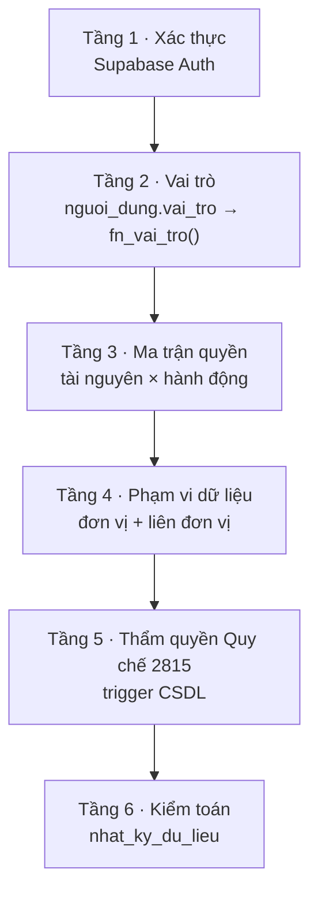
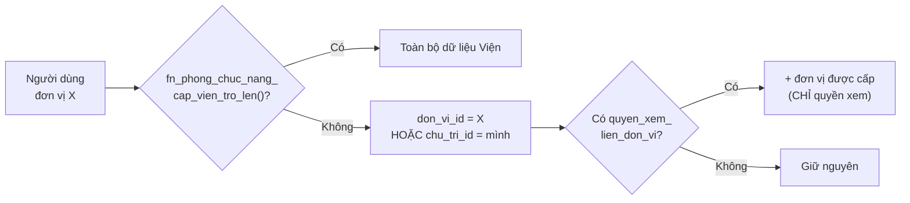

# Tài liệu Kỹ thuật Phân quyền — IBST ERP

> **Phiên bản:** 3.0 — 09/09/2026 (cập nhật sau đợt triển khai đủ Giai đoạn 1–4)
> **Phạm vi:** Toàn hệ thống `cic-ibst` (Viện Khoa học Công nghệ Xây dựng)
> **Căn cứ nghiệp vụ:** Quy chế 2815/QĐ-VKH; QĐ 942/945/946 Bộ Xây dựng
> **Kế hoạch triển khai:** xem [ke-hoach-phan-quyen-ibst.md](ke-hoach-phan-quyen-ibst.md) — Giai đoạn 1, 2, 3, 4 đều đã triển khai và kiểm chứng trên trình duyệt thật. Phạm vi Giai đoạn 3 có giới hạn CÓ CHỦ Ý (33/53 bảng, một phần chỉ siết quyền xem) — xem §13.

> [!IMPORTANT]
> Tài liệu này mô tả **cả hai trạng thái**, luôn ghi rõ:
> - 🟢 **ĐÃ CÀI** — đang chạy trên hệ thống, đã kiểm chứng trong mã nguồn/migration.
> - 🟡 **THIẾT KẾ** — mục tiêu, chưa cài đặt. Không được nói/ghi như thể đã có.

---

## 1. Tổng quan

Phân quyền IBST theo mô hình **RBAC + phạm vi đơn vị + chốt chặn quy chế**, ba lớp không thay thế nhau:

| Tầng | Trả lời câu hỏi | Cơ chế | Trạng thái |
|---|---|---|---|
| 1. Xác thực | Anh là ai? | Supabase Auth | 🟢 ĐÃ CÀI |
| 2. Vai trò | Anh thuộc nhóm nào? | `nguoi_dung.vai_tro`, `fn_vai_tro()` | 🟢 ĐÃ CÀI |
| 3. Ma trận quyền | Anh vào được màn hình nào, bấm được nút nào? | `quyen_vai_tro_mac_dinh` + `quyen_nguoi_dung`, `fn_co_quyen()`, `RouteGuard` | 🟢 ĐÃ CÀI ở tầng **route/menu** — **CHƯA** lọc tới từng tab con trong trang, xem §8.3 |
| 4. Phạm vi dữ liệu | Anh thấy được bản ghi nào? | `nguoi_dung.don_vi_id` + `quyen_xem_lien_don_vi`, `fn_don_vi_xem_duoc()` | 🟢 CSDL nền đã có (migration 0040); **RLS bảng nghiệp vụ CHƯA đọc `fn_don_vi_xem_duoc()`** — xem §13 |
| 5. Thẩm quyền 2815 | Bước ký/duyệt này ai được ký? | trigger `fn_kiem_soat_*` | 🟢 ĐÃ CÀI |
| 6. Kiểm toán | Ai đã đổi gì, lúc nào? | `nhat_ky_du_lieu` + trigger `fn_ghi_nhat_ky` / `fn_ghi_nhat_ky_quyen` | 🟢 ĐÃ CÀI, đã kiểm chứng cho cả bảng quyền mới (xem §9 — vẫn còn lỗ hổng `auditLog.ts`) |

> [!IMPORTANT]
> **Tầng 3 và Tầng 5 là hai câu hỏi khác nhau, không gộp.**
> Tầng 3 (RBAC) gác **màn hình và nút bấm** — cấu hình được, đổi bằng dữ liệu.
> Tầng 5 (Quy chế 2815) gác **bước ký duyệt** — cứng trong trigger, không cho cấu hình vì đó là quy định pháp lý nội bộ.
> Một người có `duyet` trên tài nguyên `hop_dong` (Tầng 3) **vẫn bị trigger chặn** nếu vai trò không phải Lãnh đạo Viện (Điều 6.1). Đúng như thiết kế.

---

## 2. Cơ cấu tổ chức & phạm vi dữ liệu

Bảng `don_vi` (migration 0003) chia làm ba lớp phạm vi:

| Lớp | Ví dụ | Phạm vi dữ liệu mặc định |
|---|---|---|
| **Lãnh đạo Viện** | Viện trưởng, Phó Viện trưởng | Toàn Viện |
| **Phòng chức năng cấp Viện** | P.KHKT, P.TCKT, P.TCHC | Toàn Viện (theo Đ.5.2b, Đ.9.6c, Đ.11.4) |
| **Đơn vị trực thuộc** | Viện chuyên ngành, Trung tâm, Phân viện | Đơn vị mình + hợp đồng mình chủ trì |

🟢 **ĐÃ CÀI** — hàm `fn_phong_chuc_nang_cap_vien_tro_len()` (migration 0027) trả `true` cho `quan-tri`, `lanh-dao`, `phong-khkt`, `phong-tckt`, `phong-tchc`. Đây chính là "phạm vi toàn Viện" ở tầng CSDL.

> [!WARNING]
> **Hiện có nguy cơ hai định nghĩa "phạm vi toàn Viện" chạy song song.**
> Tầng CSDL đã có `fn_phong_chuc_nang_cap_vien_tro_len()`. Khi làm Tầng 3, phía ứng dụng phải có **đúng một** hàm tương ứng (`coPhamViToanVien()` trong `src/lib/phanQuyen.ts`) và hai hàm này **phải sửa cùng nhau**.
> Dự án `cic-erp-contract` đã trả giá cho lỗi này: Chủ tịch HĐQT thấy dropdown đơn vị một phạm vi, danh sách hợp đồng một phạm vi khác — cùng một người, khác nhau tuỳ màn hình.

---

## 3. Vai trò hệ thống

### 3.1. Danh sách vai trò

🟢 **ĐÃ CÀI** — lưu ở `nguoi_dung.vai_tro`, đọc qua `fn_vai_tro()` (migration 0006).

| # | Mã | Tên | Căn cứ | Phạm vi |
|---|---|---|---|---|
| 1 | `quan-tri` | Quản trị hệ thống | — | Toàn Viện |
| 2 | `lanh-dao` | Lãnh đạo Viện (Viện trưởng, Phó Viện trưởng) | Đ.6.1 | Toàn Viện |
| 3 | `truong-don-vi` | Trưởng đơn vị | Đ.7.1c, Đ.11.2 | Đơn vị mình |
| 4 | `chuyen-vien` | Chuyên viên (chủ trì hợp đồng) | Đ.7.1c | Hợp đồng mình chủ trì |
| 5 | `phong-khkt` | Phòng Kế hoạch – Kỹ thuật | Đ.5.2b, Đ.9.6c | Toàn Viện |
| 6 | `phong-tckt` | Phòng Tài chính – Kế toán | Đ.11.4 | Toàn Viện |
| 7 | `phong-tchc` | Phòng Tổ chức – Hành chính | Đ.9.8 | Toàn Viện |
| 8 | `phong-th-don-vi` | Phòng Tổng hợp đơn vị | Đ.7.1c-4 | Đơn vị mình |
| 9 | `phu-trach-ke-toan-dv` | Phụ trách kế toán đơn vị | Đ.11.1 | Đơn vị mình |
| 10 | `can-bo-to-chuc` | Cán bộ Tổ chức – Hành chính | — | Toàn Viện (hồ sơ CBVC) |
| 11 | `van-phong-dang-uy` | Văn phòng Đảng ủy | — | Toàn Viện (Đảng – Đoàn thể) |

Vai trò mặc định khi chưa gán: **`chuyen-vien`** (`fn_vai_tro()` dùng `coalesce`).

> [!NOTE]
> **✅ ĐÃ VÁ (09/09/2026) — vai trò 10 và 11 từng chỉ tồn tại một nửa.**
> Migration `0033_rls_nhan_su_dang.sql` tạo `can-bo-to-chuc` và `van-phong-dang-uy`, **RLS đã dùng chúng thật** từ trước (`fn_la_can_bo_to_chuc()`, `fn_la_vp_dang_uy()` gác bảng lương, HĐLĐ, đảng viên), nhưng tầng TypeScript trước đây thiếu hai vai trò này ở ba nơi: `src/context/AuthContext.tsx` (kiểu `VaiTro`), `src/services/quantri.ts` (`VAI_TRO_LABEL`/`VAI_TRO_OPTIONS`), `src/lib/quyenHopDong.ts` (`NHAN_VAI_TRO`).
> Đã bổ sung đủ 11 vai trò ở cả ba nơi — Quản trị hệ thống giờ gán được hai vai trò này qua Cài đặt → Người dùng & vai trò. Ma trận `quyen_vai_tro_mac_dinh` (migration 0040) cũng đã seed quyền mặc định cho cả hai (xem §5.3).

### 3.2. Điều kiện đăng nhập

🟢 **ĐÃ CÀI** — có phiên Supabase Auth hợp lệ (`RequireAuth` trong `src/App.tsx:23`).

> [!CAUTION]
> **Chưa có điều kiện "phải tồn tại trong `nguoi_dung`".** Một tài khoản Auth chưa có dòng trong `nguoi_dung` vẫn đăng nhập được và nhận vai trò `chuyen-vien` mặc định.
> Ngoài ra, tài khoản **chưa gắn `nguoi_dung.nhan_su_id`** sẽ không tự đọc được hồ sơ của chính mình ở các bảng nhạy cảm — đã được ghi chú sẵn trong `comment on function fn_nhan_su_id_hien_tai()` (migration 0033). Phòng TCHC phải gắn `nhan_su_id` ngay khi cấp tài khoản.

### 3.3. Cờ phát triển

| Biến `.env` | Tác dụng | Rủi ro |
|---|---|---|
| `VITE_AUTO_LOGIN` | Tự đăng nhập khi `npm run dev` | Chỉ chạy khi `import.meta.env.DEV` — an toàn |
| `VITE_SKIP_AUTH` | Bỏ qua `RequireAuth` | Chỉ chạy khi `DEV` — an toàn |

> [!IMPORTANT]
> Khi làm RouteGuard (Tầng 3), nếu cần cờ bỏ qua kiểm tra quyền thì phải là cờ **riêng** `VITE_SKIP_PERM`, **mặc định tắt**.
> ❌ **KHÔNG** bê cách làm của `cic-erp-contract` (`RouteGuard.tsx:42` bỏ qua toàn bộ kiểm tra quyền khi hostname là `localhost`) — dòng đó khiến không ai test được phân quyền thật trên máy dev, và bug phân quyền chỉ lộ ra khi đã lên production.

---

## 4. Từ điển Tài nguyên × Hành động 🟢 ĐÃ CÀI

> `src/lib/phanQuyen.ts` — 29 tài nguyên, 6 hành động. Nội dung §4.1/§4.2 dưới đây khớp 100% với code đang chạy (không còn là dự thảo).

### 4.1. Hành động

| Mã | Nhãn | Ghi chú |
|---|---|---|
| `xem` | Xem | |
| `them` | Thêm | |
| `sua` | Sửa | |
| `xoa` | Xóa | |
| `duyet` | Trình / Phê duyệt | Tách riêng vì 2815 phân biệt rõ nhập liệu với trình duyệt |
| `xuat` | Xuất Excel/PDF | Tách riêng vì báo cáo tài chính in cột lợi nhuận |

### 4.2. Tài nguyên — bám đúng menu và tab hiện có

| Nhóm menu (`AppLayout.tsx:70`) | Mã tài nguyên | Nguồn tab |
|---|---|---|
| 1. Dashboard | `dashboard`, `dashboard_tai_chinh` | `DashboardPage` — 5 tab |
| 2. Hợp đồng, CRM & Tài chính | `hop_dong`, `tai_chinh`, `khach_hang`, `dau_thau`, `pvqlnn`, `bao_cao_khkt` | `HopDongPage.tsx:132` — 6 tab |
| 3. Khoa học & SHTT | `de_tai`, `tap_chi`, `so_huu_tri_tue`, `chuyen_giao` | `KhoaHocPage.tsx:10` — 4 tab |
| 4. Tổ chức & Nhân sự | `co_cau_to_chuc`, `don_vi`, `nhan_su`, `dao_tao_ncs`, `dang_doan_the`, `danh_gia` | `NhanSuPage.tsx:48` — 6 tab |
| 5. Thử nghiệm LIMS | `mau_thu`, `thiet_bi_las`, `dau_tu_cong` | `ThiNghiemPage.tsx:26` — 3 tab |
| 6. e-Office | `van_ban`, `cong_viec` | `EOfficePage.tsx:9` — 2 tab |
| 7. Kho lưu trữ | `ho_so_tai_lieu`, `ai_rag` | `KhoLuuTruPage.tsx:8` — 2 tab |
| Khác | `lich_co_quan`, `cai_dat`, `phan_quyen`, `nhat_ky` | `LichCoQuanPage`, `CaiDatPage.tsx:27` |

**Tổng: 29 tài nguyên × 6 hành động.**

> [!WARNING]
> **Không làm fallback tài nguyên con → tài nguyên cha.** Ví dụ: `tai_chinh` không có bản ghi quyền thì **không** được tra sang `hop_dong`.
> `cic-erp-contract` đã phải gỡ bỏ cơ chế fallback `crm_*` → `crm` vì nó gây rò quyền im lặng: cấp quyền CRM tổng quan cho một người là vô tình mở luôn mọi module con.

---

## 5. Ma trận phân quyền theo chức năng 🟢 ĐÃ SEED VÀO CSDL — VẪN CẦN NGHIỆP VỤ DUYỆT CHÍNH THỨC

> Bảng dưới đây đã được nạp thật vào `quyen_vai_tro_mac_dinh` (migration 0040, 185 dòng, kiểm chứng bằng SQL) và đang **chi phối thật** menu/route hiển thị cho toàn bộ 10 vai trò không phải Quản trị. Đây **không còn là bản vẽ trên giấy** — nhưng vẫn là quyết định của người viết migration dựa theo Quy chế 2815 + RLS hiện hành, **chưa có xác nhận chính thức từ nghiệp vụ (Giai đoạn 0 chưa làm)**. Quản trị hệ thống chỉnh trực tiếp qua Cài đặt → Quyền theo vai trò mà không cần migration mới — xem §8.4.

**Ký hiệu:** `X` xem · `T` thêm · `S` sửa · `D` xóa · `P` duyệt · `E` xuất · `—` không có quyền

**Cột vai trò:** QT (quản-trị) · LĐ (lãnh-đạo) · TĐV (trưởng-đơn-vị) · CV (chuyên-viên) · KHKT · TCKT · TCHC · THĐV (phòng-TH-đơn-vị) · KTĐV (phụ-trách-kế-toán-ĐV) · CBTC (cán-bộ-tổ-chức) · VPĐU (VP-Đảng-ủy)

### 5.1. Hợp đồng, CRM & Tài chính

| Tài nguyên | QT | LĐ | TĐV | CV | KHKT | TCKT | TCHC | THĐV | KTĐV | CBTC | VPĐU |
|---|:--:|:--:|:--:|:--:|:--:|:--:|:--:|:--:|:--:|:--:|:--:|
| `hop_dong` | tất cả | XTSDPE | XTSP | XTS | XSPE | XE | X | XP | X | — | — |
| `tai_chinh` | tất cả | XE | X | X | X | XTSDE | — | X | XTS | — | — |
| `khach_hang` | tất cả | XTSD | XTS | XTS | XTS | X | — | X | — | — | — |
| `dau_thau` | tất cả | XTSDP | XTSP | XTS | XTSPE | X | — | X | — | — | — |
| `pvqlnn` | tất cả | XTSDP | XTS | XTS | XTSE | X | X | X | — | — | — |
| `bao_cao_khkt` | tất cả | XE | X | — | XTSDE | X | — | — | — | — | — |

> [!IMPORTANT]
> **`chuyen-vien` chỉ sửa hợp đồng mình chủ trì** — không sửa được hợp đồng của đồng nghiệp cùng đơn vị. Đây là **phạm vi dữ liệu (Tầng 4)**, không phải hành động (Tầng 3): quyền `sua` vẫn được cấp, nhưng RLS lọc bản ghi bằng `chu_tri_id`.
> 🟢 ĐÃ CÀI ở policy `hd_sua_theo_don_vi` (migration 0027).

> [!NOTE]
> **P.TCKT và Phụ trách kế toán ĐV không sửa nội dung hợp đồng**, chỉ ghi nhận số liệu tài chính. Ranh giới này đã có thật ở tầng dữ liệu: `hop_dong.da_thanh_toan` là **số dẫn xuất** do trigger `trg_dot_thanh_toan_dong_bo` (migration 0034) cộng từ `dot_thanh_toan` — không ai nhập tay được.

### 5.2. Khoa học & Sở hữu trí tuệ

| Tài nguyên | QT | LĐ | TĐV | CV | KHKT | TCKT | TCHC | THĐV | KTĐV | CBTC | VPĐU |
|---|:--:|:--:|:--:|:--:|:--:|:--:|:--:|:--:|:--:|:--:|:--:|
| `de_tai` | tất cả | XTSDP | XTS | XTS | XTSPE | X | — | X | — | — | — |
| `tap_chi` | tất cả | XTSDP | X | X | XTS | — | — | — | — | — | — |
| `so_huu_tri_tue` | tất cả | XTSDP | XTS | X | XTS | X | — | — | — | — | — |
| `chuyen_giao` | tất cả | XTSDP | XTS | XTS | XTS | XE | — | X | — | — | — |

### 5.3. Tổ chức & Nhân sự

| Tài nguyên | QT | LĐ | TĐV | CV | KHKT | TCKT | TCHC | THĐV | KTĐV | CBTC | VPĐU |
|---|:--:|:--:|:--:|:--:|:--:|:--:|:--:|:--:|:--:|:--:|:--:|
| `co_cau_to_chuc` | tất cả | XTSD | X | X | X | X | XTS | X | — | XTS | X |
| `don_vi` | tất cả | XTSD | X | X | X | X | XTS | — | — | XTS | — |
| `nhan_su` | tất cả | XTSDE | X *(ĐV mình)* | X *(chính mình)* | X | X | XTSD | X *(ĐV mình)* | — | XTSDE | X |
| `dao_tao_ncs` | tất cả | XTSDP | XTS | X *(chính mình)* | X | — | XTS | X | — | XTSD | — |
| `dang_doan_the` | tất cả | X | — | X *(chính mình)* | — | — | — | — | — | — | XTSDPE |
| `danh_gia` | tất cả | XTSDPE | XTS *(ĐV mình)* | X *(chính mình)* | — | — | XTS | X | — | XTSDE | — |

> [!CAUTION]
> **Ba nhóm dữ liệu nhạy cảm — RLS đã siết sẵn, ma trận Tầng 3 phải khớp, không được nới rộng hơn:**
> 1. **Lương, HĐLĐ, đánh giá CBVC** (`hop_dong_lao_dong`, `luong_ngach_bac`, `danh_gia_cbvc`): đọc = chính chủ **hoặc** `can-bo-to-chuc` **hoặc** lãnh đạo trở lên. Ghi = `can-bo-to-chuc`.
> 2. **Hồ sơ đảng viên/đoàn viên, phát triển đảng** (`dang_vien`, `doan_vien_hoi_vien`, `phat_trien_dang`): đọc = chính chủ **hoặc** `van-phong-dang-uy` **hoặc** lãnh đạo trở lên **hoặc** bí thư/phó bí thư đúng tổ chức đó (`fn_la_phu_trach_to_chuc`). Ghi = VP Đảng ủy hoặc phụ trách tổ chức.
> 3. **Sinh hoạt, điểm danh, đảng phí** (`sinh_hoat_dinh_ky`, `thu_phi_doan_the`, `diem_danh_sinh_hoat`): cùng mức với nhóm 2.
>
> 🟢 ĐÃ CÀI ở migration 0033. **Trưởng đơn vị không có quyền đọc dữ liệu Đảng của nhân viên mình** — đây là chủ ý, không phải thiếu sót.

### 5.4. Thử nghiệm, e-Office, Kho lưu trữ, khác

| Tài nguyên | QT | LĐ | TĐV | CV | KHKT | TCKT | TCHC | THĐV | KTĐV | CBTC | VPĐU |
|---|:--:|:--:|:--:|:--:|:--:|:--:|:--:|:--:|:--:|:--:|:--:|
| `mau_thu` | tất cả | XP | XTSP | XTS | XP | — | — | X | — | — | — |
| `thiet_bi_las` | tất cả | X | XTS | X | XTS | X | X | X | — | — | — |
| `dau_tu_cong` | tất cả | XTSDP | X | — | XTSE | XE | — | — | — | — | — |
| `van_ban` | tất cả | XTSDP | XTSP | XTS | XTS | XTS | XTSD | XTS | X | XTS | XTS |
| `cong_viec` | tất cả | XTSDP | XTSP | XTS | XTS | XTS | XTS | XTS | XTS | XTS | XTS |
| `ho_so_tai_lieu` | tất cả | XTSD | XTS | XTS | XTS | XTS | XTSD | XTS | XTS | XTS | XTS |
| `ai_rag` | tất cả | X | X | X | X | X | X | X | X | X | X |
| `lich_co_quan` | tất cả | XTSDP | XTSP | XT | XTS | X | XTSDP | XTS | X | XTS | XTS |
| `dashboard` | tất cả | XE | X | X | X | X | X | X | X | X | X |
| `dashboard_tai_chinh` | tất cả | XE | X *(ĐV mình)* | — | X | XE | — | — | X *(ĐV mình)* | — | — |
| `cai_dat` | tất cả | X | — | — | — | — | X | — | — | — | — |
| `phan_quyen` | tất cả | X | — | — | — | — | — | — | — | — | — |
| `nhat_ky` | tất cả | X | — | — | — | — | — | — | — | — | — |

> [!IMPORTANT]
> **`dashboard_tai_chinh` phải cắt số liệu khỏi payload, không che bằng CSS.**
> Với vai trò không có quyền, các trường doanh thu/lợi nhuận/công nợ **không được có mặt** trong dữ liệu trả về — dùng RPC `SECURITY DEFINER` chỉ trả con số tổng. Lớp `blur` chỉ là hiển thị; F12 vẫn moi ra được nếu số vẫn nằm trong payload.
> Tổng toàn Viện **không được cộng ở trình duyệt**: khi RLS chỉ trả hợp đồng của đơn vị mình, phép cộng phía client ra tổng của riêng đơn vị đó nhưng gắn nhãn "Toàn Viện" — sai số im lặng, không có cảnh báo nào.

---

## 6. Phạm vi dữ liệu

### 6.1. Quy tắc lọc bản ghi

🟢 **ĐÃ CÀI** — nhánh trái và giữa, tại migration 0027 cho `hop_dong`, `dau_thau`, `dang_ky_dau_moi` và 8 bảng con (`phieu_giao_viec`, `dot_thanh_toan`, `hop_dong_thuong_phat`, `kiem_tra_noi_bo`, `quyet_toan_giai_doan`, `hop_dong_tep_dinh_kem`, `lien_danh`, `luu_tru_ho_so`).

🟡 **THIẾT KẾ** — nhánh `quyen_xem_lien_don_vi`.

### 6.2. Quyền xem liên đơn vị 🟡 THIẾT KẾ

Bảng `quyen_xem_lien_don_vi (nhan_su_id, don_vi_duoc_xem_id, granted_by, created_at)`.

> [!NOTE]
> Quyền này **chỉ mở rộng hành động `xem`**, không kèm `them`/`sua`/`xoa`/`duyet`.
> Ví dụ: Trưởng Viện Chuyên ngành Kết cấu được cấp quyền xem Phân viện Miền Trung khi phối hợp một hợp đồng → thấy hợp đồng của cả hai, nhưng chỉ sửa được của đơn vị mình.

---

## 7. Thẩm quyền theo Quy chế 2815 (Tầng 5)

🟢 **ĐÃ CÀI** — đây là lớp mạnh nhất, nằm ở trigger CSDL, **không cấu hình được qua giao diện**.

### 7.1. Phê duyệt hợp đồng — Điều 6.1 & 9.6c

Trigger `fn_kiem_soat_tham_quyen_hop_dong` (bản hiện hành: migration 0026):

| Chuyển trạng thái | Điều kiện bắt buộc | Vai trò được phép |
|---|---|---|
| → `da-trinh` | Trạng thái trước **phải là** `cho-khkt-tham-tra` | `fn_khkt_tro_len()` = `quan-tri`, `lanh-dao`, `phong-khkt` |
| → `da-duyet` | — | `fn_lanh_dao_tro_len()` = `quan-tri`, `lanh-dao` |
| → quyết toán, `cap_ky = 'don-vi-ky'` | — | Trưởng ĐV trở lên, hoặc `phong-tckt`, `phu-trach-ke-toan-dv` |
| → quyết toán, cấp Viện ký | — | `fn_tckt_tro_len()` = `quan-tri`, `lanh-dao`, `phong-tckt` |

Vi phạm → `raise exception` mã lỗi `42501` kèm tên vai trò và điều khoản viện dẫn.

### 7.2. Ký quyết định giao việc — Điều 7.1c, 4 nhánh

🟢 **ĐÃ CÀI** — trigger `fn_kiem_soat_ky_giao_viec` + `fn_nhanh_ky_giao_viec` (migration 0035), phản chiếu ở `src/lib/kyGiaoViec.ts`.

| Nhánh | Điều kiện chọn nhánh | Luồng ký |
|---|---|---|
| **A** — HĐ Viện ký | mặc định | Chủ trì soạn → Trưởng ĐV xác nhận → P.KHKT thẩm tra → Lãnh đạo Viện duyệt |
| **B** — HĐ phức tạp/chính trị | `phuc_tap = true` và `cap_ky ≠ don-vi-ky` | P.KHKT soạn → Viện trưởng ký duyệt |
| **C** — HĐ đơn vị phân cấp ký | `cap_ky = don-vi-ky` | Chủ trì soạn → Phòng/xưởng xác nhận → P.Tổng hợp ĐV thẩm tra → Trưởng ĐV duyệt |
| **D** — HĐ quản lý tập trung | `quan_ly_tap_trung = true` | Trưởng ĐV đề xuất → Lãnh đạo Viện ký quyết định |

SLA kèm theo: P.KHKT thẩm tra hồ sơ hợp đồng **01 ngày làm việc** (Đ.9.6c) — trigger `fn_sinh_sla_tham_tra_hop_dong` ghi vào `sla_theo_doi`.

### 7.3. Phản chiếu ở tầng giao diện

`src/lib/quyenHopDong.ts` và `src/lib/kyGiaoViec.ts` giữ bản sao ma trận thẩm quyền để **ẩn nút vượt thẩm quyền**, không phải để chặn.

> [!IMPORTANT]
> Hai file này đã tự ghi chú: *"Giao diện chỉ để hướng dẫn; chốt chặn thật nằm ở CSDL."*
> Khi sửa trigger phải sửa file tương ứng và ngược lại — nếu lệch, người dùng sẽ thấy nút bấm được rồi nhận lỗi `42501` khó hiểu.

---

## 8. Chốt chặn tầng ứng dụng 🟢 ĐÃ CÀI (route/menu + tab con trong 7 trang)

### 8.1. Hiện trạng trước đợt vá (09/09/2026) — đã sửa

> [!NOTE]
> Trước đây `src/App.tsx` chỉ có `RequireAuth` (kiểm tra đã đăng nhập), không kiểm tra quyền theo trang — mọi tài khoản gõ thẳng URL vào được mọi trang. Đã vá bằng `RouteGuard` (bọc `<Outlet/>` trong `AppLayout.tsx`, không sửa `App.tsx`) — xem §8.2, đã kiểm chứng trên trình duyệt thật (tài khoản `phong-khkt` bị chặn `/cai-dat` với màn hình "Truy cập bị từ chối" đúng thiết kế).

### 8.2. Đã cài đặt

| Thành phần | File | Trách nhiệm | Trạng thái |
|---|---|---|---|
| Hằng số & nhãn | `src/lib/phanQuyen.ts` | `TAI_NGUYEN[]`, `HANH_DONG[]`, `NHAN_TAI_NGUYEN`, `coPhamViToanVien()` | 🟢 |
| Hook kiểm tra | `src/hooks/usePhanQuyen.ts` | `can(taiNguyen, hanhDong)`, `donViXemDuocThem`, `dangTai` | 🟢 |
| Bảng ánh xạ route | `src/routes/quyenTruyCap.ts` | `ROUTE_PERMISSION_MAP`, `PUBLIC_ROUTES`, `getRoutePermission()` | 🟢 |
| Chốt chặn route | `src/components/RouteGuard.tsx` | Deny-by-default, bọc `<Outlet/>` trong `AppLayout.tsx` | 🟢 — kiểm chứng trên trình duyệt |
| Lọc menu | `src/layouts/AppLayout.tsx` (`hienThiMucMenu`) | Lọc `NAV_MENU` bằng **chính** `ROUTE_PERMISSION_MAP` | 🟢 — kiểm chứng trên trình duyệt |
| Lọc tab con trong trang | `HopDongPage` (6 tab), `KhoaHocPage` (4), `NhanSuPage` (6), `ThiNghiemPage` (3), `EOfficePage` (2), `KhoLuuTruPage` (2), `DashboardPage` (tab "Tài chính & Đầu tư") | Ẩn tab không có quyền `xem`; tự chuyển sang tab được phép đầu tiên khi tab đang chọn bị ẩn (`src/lib/phanQuyen.ts::tabDuocPhep()`) | 🟢 — kiểm chứng bằng `tsc`/`build` sạch, chưa quét đủ 9 vai trò trên trình duyệt (xem §8.3) |

### 8.3. Còn lại — chưa quét hết 9 vai trò × 3 theme cho tab con

> [!NOTE]
> Cơ chế lọc tab đã cài đúng khuôn với menu (cùng dùng `tabDuocPhep()`/`hienThiMucMenu()`), nhưng chỉ mới kiểm chứng bằng `tsc -b --noEmit` + `npm run build` sạch cho cả 7 trang, **chưa** đăng nhập lần lượt đủ 9 vai trò để xác nhận từng trang thực sự ẩn đúng tab trên trình duyệt (mới xác nhận trực tiếp menu cấp trang với `phong-khkt`/`quan-tri` — xem §8.1). Việc còn lại là kiểm thử trực quan, không phải phần code chưa viết.

### 8.4. Quy tắc bắt buộc khi mở rộng

1. **Deny-by-default.** Route không khai báo trong `ROUTE_PERMISSION_MAP` và không nằm trong `PUBLIC_ROUTES` ⇒ **chặn**, không phải cho qua.
2. **Menu hiện ⇔ vào được bằng link.** Sidebar và RouteGuard đọc chung một bảng ánh xạ. Không được duy trì hai danh sách song song.
3. **Không dùng cờ bỏ qua theo hostname.** `RouteGuard.tsx` cố tình KHÔNG có nhánh `localhost` bypass (khác `cic-erp-contract`) — chỉ có cờ tường minh `VITE_SKIP_PERM=true`, mặc định tắt.

> [!WARNING]
> **`usePhanQuyen()` tự viết effect riêng (không dùng `useAsyncData`)** chính vì lý do đã nêu ở CLAUDE.md: `useAsyncData` không refetch khi tham số đầu vào đổi giữa hai lần render. `can()` trả `false` khi `dangTai === true`; `RouteGuard`/`AppLayout` phải tự kiểm `dangTai` để không chặn nhầm người dùng hợp lệ ngay lúc trang vừa mở — đã áp dụng đúng ở cả hai nơi.

---

## 9. Kiểm toán

### 9.1. Nhật ký dữ liệu — CSDL 🟢 ĐÃ CÀI

Trigger `fn_ghi_nhat_ky` (migration 0001, siết lại ở 0013) ghi vào `nhat_ky_du_lieu`:

| Trường | Nội dung |
|---|---|
| `ten_bang`, `ban_ghi_id` | Đối tượng bị tác động |
| `hanh_dong` | INSERT / UPDATE / DELETE |
| `du_lieu_cu`, `du_lieu_moi` | Trước và sau thay đổi |
| `nguoi_thuc_hien`, `thoi_diem` | Ai, lúc nào |

RLS: chỉ `fn_lanh_dao_tro_len()` được đọc (migration 0006).

### 9.2. Lịch sử phê duyệt hiển thị trên giao diện

> [!CAUTION]
> **`src/services/auditLog.ts` lưu lịch sử phê duyệt vào `localStorage`, không lưu CSDL** (`STORAGE_KEY = 'ibst_audit_logs'`).
> Hệ quả: timeline phê duyệt hiển thị trên màn hình là **dữ liệu riêng của từng trình duyệt** — mỗi máy thấy một lịch sử khác nhau, xóa cache là mất, và người dùng có thể sửa trực tiếp bằng DevTools. Nó **không dùng được làm bằng chứng kiểm toán** theo Quy chế 2815.
> Nguồn sự thật cho việc "ai đã duyệt bước nào" hiện chỉ có `nhat_ky_du_lieu` ở CSDL.
> **Đề xuất:** chuyển `auditLog.ts` sang đọc/ghi bảng CSDL trong cùng đợt Tầng 3, hoặc đổi tên rõ ràng thành dữ liệu trình diễn để không ai nhầm là bằng chứng.

### 9.3. Nhật ký thay đổi quyền 🟡 THIẾT KẾ

Mọi thao tác cấp/thu quyền ở màn hình quản trị phải ghi vào `nhat_ky_du_lieu`: ai cấp, cấp cho ai, tài nguyên nào, hành động nào, trước/sau.

---

## 10. Đối chiếu Hiện trạng ↔ Thiết kế

> Cập nhật sau đợt triển khai 09/09/2026 — Giai đoạn 1, 2, 3, 4 (xem [ke-hoach-phan-quyen-ibst.md](ke-hoach-phan-quyen-ibst.md) §5).

| Hạng mục | Hiện trạng | Mục tiêu |
|---|---|---|
| Vai trò | 🟢 11 vai trò ở CSDL **và** TypeScript (đã đồng bộ 3 file) | — Xong |
| Ma trận tài nguyên × hành động | 🟢 29 tài nguyên × 6 hành động, seed 185 dòng ở `quyen_vai_tro_mac_dinh` | — Xong (nội dung vẫn là DỰ THẢO chưa duyệt nghiệp vụ chính thức) |
| Quyền theo từng người | 🟢 `quyen_nguoi_dung`, UI tạo/khôi phục đã kiểm thử trên trình duyệt | — Xong |
| Chốt chặn route | 🟢 `RouteGuard`, deny-by-default, kiểm chứng thật | — Xong |
| Lọc menu | 🟢 `AppLayout.hienThiMucMenu()` dùng chung `ROUTE_PERMISSION_MAP` | — Xong |
| Lọc TAB con trong trang | 🟢 7 trang (§8.2), `tsc`/`build` sạch — chưa quét đủ 9 vai trò trên trình duyệt (§8.3) | — Xong phần code |
| Phạm vi đơn vị (CSDL nền) | 🟢 `quyen_xem_lien_don_vi`, `fn_don_vi_xem_duoc()` — đã tạo, đã kiểm thử cấp/xóa | — Xong phần nền |
| **RLS bảng nghiệp vụ đọc ma trận mới** | 🟢 33/53 bảng đã nối `fn_co_quyen()` (migration 0041) — **13 bảng** siết đủ xem/thêm/sửa/xóa, **20 bảng** chỉ siết xem (xem §13 vì sao không siết đều) | Giai đoạn 0 duyệt ma trận chính thức rồi siết ghi cho 20 bảng còn lại |
| Lỗi im lặng khi RLS chặn UPDATE/DELETE | 🟢 **Phát hiện + vá trong đợt này** — `src/lib/rlsGuard.ts`, áp dụng cho ~20 hàm service của 13 bảng vừa siết đủ 4 lệnh (§13.3) | — Xong cho 13 bảng đó; 20 bảng "chỉ xem" không phát sinh rủi ro này (chưa đổi quyền ghi) |
| Thẩm quyền 2815 | 🟢 Trigger đầy đủ, không đổi | **Giữ nguyên, không thay bằng RBAC** |
| Dữ liệu nhạy cảm (lương, Đảng) | 🟢 RLS đã siết (0033), migration 0041 KHÔNG đụng vào (giữ nguyên ngoại lệ tự xem) | — Xong |
| Kiểm toán CSDL | 🟢 `nhat_ky_du_lieu` + `fn_ghi_nhat_ky_quyen` — đã kiểm chứng ghi đúng cho cả 3 bảng quyền mới | — Xong |
| Timeline phê duyệt trên UI | 🔴 `auditLog.ts` vẫn `localStorage` | Chuyển sang CSDL |
| UI quản trị quyền | 🟢 2 tab mới ở `CaiDatPage` (Quyền theo vai trò / Quyền theo người dùng), đã kiểm thử trên trình duyệt | — Xong |

> [!IMPORTANT]
> **Ma trận "Quyền theo vai trò" giờ có tác dụng thật trên 33/53 bảng nghiệp vụ**, không chỉ đổi menu/route như trước. Đã kiểm chứng trực tiếp trên trình duyệt: `phong-khkt` sửa hồ sơ `nhan_su` (không có quyền `sua`) → CSDL từ chối, giao diện báo lỗi rõ ràng thay vì âm thầm đóng panel. 20 bảng còn lại (hợp đồng, đấu thầu, thanh toán...) **chỉ siết quyền xem** — quyền ghi vẫn theo đúng logic phạm vi đơn vị/chủ trì cũ, có lý do cụ thể ở §13, không phải bỏ sót.

---

## 11. Quy tắc bắt buộc khi sửa phân quyền

1. **Một quyền chỉ định nghĩa ở một nơi.** Quyền mặc định theo vai trò ⇒ bảng CSDL, không hard-code. `DEFAULT` trong code chỉ là fallback lúc DB đang tải.
2. **Sửa cặp đôi.** `coPhamViToanVien()` ↔ `fn_pham_vi_toan_vien()`; `quyenHopDong.ts` ↔ `fn_kiem_soat_tham_quyen_hop_dong`; `kyGiaoViec.ts` ↔ `fn_kiem_soat_ky_giao_viec`. Mỗi cặp phải có ghi chú trỏ chéo sang nhau.
3. **Migration idempotent**, `drop policy if exists` trước `create policy`, bật RLS cùng lúc tạo bảng nhạy cảm. **Không seed dữ liệu mẫu trong migration.**
4. **Kiểm chứng bằng truy vấn thật** (`pg_policies`, `pg_proc`, `information_schema`) — "chạy không báo lỗi" không phải bằng chứng (bài học migration 0012).
5. **Không kiểm chứng RLS bằng SQL được.** Chạy qua Supabase Management API thì `fn_vai_tro()` trả `chuyen-vien` vì không có `auth.uid()`, nên mọi kiểm tra vai trò đều chặn. **Bắt buộc kiểm thử end-to-end trên trình duyệt** với dropdown quick-login 23 tài khoản.
6. **Che số liệu là cắt khỏi payload**, không phải `blur` CSS.
7. **Giao diện quản trị quyền dùng slide panel** (`useSlidePanelForm` / `useSlidePanelChiTiet`), mỗi panel một `storageKey`; không `Modal`, không `window.prompt`.
8. **Bảng ma trận quyền là lưới dày** — kiểm thử đủ 3 theme (`nature` / `light` / `dark`), viền `dark:border-slate-700/80`, `thead tr` `dark:bg-slate-900/60`, `tbody` `dark:divide-slate-700/80`.

---

## 12. Phụ lục — Hàm CSDL hiện có 🟢

| Hàm | Migration | Trả về |
|---|---|---|
| `fn_vai_tro()` | 0006 | Vai trò người dùng hiện tại, mặc định `chuyen-vien` |
| `fn_la_quan_tri()` | 0006 | `vai_tro = 'quan-tri'` |
| `fn_lanh_dao_tro_len()` | 0006 | `quan-tri`, `lanh-dao` |
| `fn_don_vi_hien_tai()` | 0012 | `nguoi_dung.don_vi_id` |
| `fn_truong_don_vi_tro_len()` | 0013 | `quan-tri`, `lanh-dao`, `truong-don-vi` |
| `fn_khkt_tro_len()` | 0022 | `quan-tri`, `lanh-dao`, `phong-khkt` |
| `fn_tckt_tro_len()` | 0022 | `quan-tri`, `lanh-dao`, `phong-tckt` |
| `fn_phong_chuc_nang_cap_vien_tro_len()` | 0027 | + `phong-tchc` — **phạm vi toàn Viện** |
| `fn_nhan_su_id_hien_tai()` | 0033 | `nguoi_dung.nhan_su_id` |
| `fn_la_can_bo_to_chuc()` | 0033 | `can-bo-to-chuc`, `quan-tri` |
| `fn_la_vp_dang_uy()` | 0033 | `van-phong-dang-uy`, `quan-tri` |
| `fn_la_phu_trach_to_chuc(id)` | 0033 | Bí thư/phó bí thư của tổ chức Đảng – Đoàn thể đó |
| `fn_kiem_soat_tham_quyen_hop_dong()` | 0026 | Trigger — chặn vượt thẩm quyền Đ.6.1, Đ.9.6c, Đ.11 |
| `fn_kiem_soat_ky_giao_viec()` | 0035 | Trigger — chặn vượt thẩm quyền Đ.7.1c |
| `fn_ghi_nhat_ky()` | 0001, 0013 | Trigger — ghi `nhat_ky_du_lieu` (bảng có cột `id` đơn) |
| `fn_co_quyen(tai_nguyen, hanh_dong)` | 0040 | Tầng 3 — quyết định theo `quyen_nguoi_dung` rồi `quyen_vai_tro_mac_dinh`; `quan-tri` bypass |
| `fn_don_vi_xem_duoc()` | 0040 | `bigint[]` — đơn vị mình + `quyen_xem_lien_don_vi` |
| `fn_pham_vi_toan_vien()` | 0040 | Alias `fn_phong_chuc_nang_cap_vien_tro_len()` — tên chuẩn dùng từ Tầng 3 trở đi |
| `fn_ghi_nhat_ky_quyen()` | 0040 | Trigger — bản riêng của `fn_ghi_nhat_ky()` cho bảng khóa chính ghép (không có cột `id`) |

> [!NOTE]
> `fn_co_quyen()`/`fn_don_vi_xem_duoc()` đã được **tạo, nối vào 33 bảng nghiệp vụ, và kiểm chứng qua UI lẫn trình duyệt** (Cài đặt → Quyền theo vai trò/người dùng) — xem §13 để biết bảng nào, cách nối, và vì sao không phải cả 53 bảng.

---

## 13. Giai đoạn 3 — phạm vi thật đã siết, và vì sao không siết đều tất cả

Migration `0041_siet_rls_tang3_ma_tran.sql`. Kỹ thuật: **policy RESTRICTIVE**. Postgres OR các
policy PERMISSIVE cùng lệnh với nhau, rồi AND với mọi policy RESTRICTIVE cùng lệnh — nên thêm
policy RESTRICTIVE gọi `fn_co_quyen()` **không sửa/xóa một policy cũ nào**. Toàn bộ logic phạm vi
đơn vị/chủ trì hiện có (Tầng 4) giữ nguyên 100%, chỉ bị AND thêm điều kiện "có quyền trên tài
nguyên" (Tầng 3) chồng lên trên.

### 13.1. Nhóm A — 13 bảng, siết đủ 4 lệnh (xem/thêm/sửa/xóa)

`nhan_su`, `chung_chi_hanh_nghe`, `khach_hang`, `van_ban`, `don_vi`, `de_tai`, `moc_de_tai`,
`mau_thi_nghiem`, `ket_qua_phep_thu`, `so_tap_chi`, `bai_bao_khoa_hoc`, `phan_bien_khoa_hoc`,
`lop_dao_tao`.

Lý do siết được **đủ cả 4 lệnh** mà an toàn: rà policy thật (`pg_policies.qual`) trước khi làm thì
phát hiện các bảng này đang **mở hoàn toàn** — `qual = true` hoặc `auth.role() = 'authenticated'`,
không một điều kiện phạm vi hay vai trò nào. Vì hiện tại không có phân biệt gì để so sánh, siết
theo ma trận chỉ có thể XIẾT CHẶT, không thể phá luồng vai trò nào — vì chưa từng có luồng vai trò
nào để phá.

### 13.2. Nhóm B — 20 bảng, CHỈ siết quyền XEM

`hop_dong`, `hop_dong_thuong_phat`, `hop_dong_tep_dinh_kem`, `kiem_tra_noi_bo`,
`kiem_tra_khac_phuc`, `quyet_toan_giai_doan`, `dot_thanh_toan`, `lien_danh`, `luu_tru_ho_so`,
`phieu_giao_viec`, `phieu_giao_viec_ctv`, `phieu_giao_viec_don_vi`, `phan_phoi_hop_dong`,
`to_phan_phoi`, `tien_do_hop_dong`, `dang_ky_dau_moi`, `dau_thau`, `nhiem_vu_pvqlnn`,
`de_nghi_xuat_hoa_don`, `tam_ung`.

> [!CAUTION]
> **Bằng chứng cụ thể, không phải suy đoán.** Kiểm tra `components/DetailPanels.tsx` (nơi tạo/sửa
> đợt thanh toán `dot_thanh_toan`) và `pages/DauThauPage.tsx`: **không có bất kỳ kiểm tra `vaiTro`
> nào** trước khi ghi. Nghĩa là hiện tại, bất kỳ ai trong phạm vi đơn vị/chủ trì đều ghi được các
> bảng này — không có sự phân biệt "NVKD chỉ nhập dự kiến, Kế toán ghi nhận thực tế" như tài liệu
> nghiệp vụ mô tả (§5.1). Ma trận Tầng 3 (migration 0040) lại xây **đúng theo ý định đó** — siết
> thẳng quyền ghi theo ma trận sẽ chặn nhầm luồng nhập liệu thật đang chạy, vì các bảng này chưa
> tách cột dự kiến/thực tế để phân quyền đúng ở mức đó. Nên nhóm này CHỈ siết xem, chờ Giai đoạn 0
> (nghiệp vụ duyệt ma trận chính thức, có thể kèm tách cột) rồi mới siết ghi.
>
> `de_nghi_xuat_hoa_don`, `tam_ung` tuy đang **mở hoàn toàn** giống Nhóm A, nhưng cùng dạng "bên
> kinh doanh đề xuất, Kế toán duyệt" như `dot_thanh_toan` nên xếp vào Nhóm B, không phải Nhóm A.

### 13.3. Bug tìm thấy khi kiểm thử: RLS chặn UPDATE không báo lỗi

> [!CAUTION]
> **Phát hiện có thật, đã kiểm chứng bằng dữ liệu thật.** Postgres RLS lọc UPDATE/DELETE ở mệnh đề
> `USING` — không khớp thì Postgres coi như "0 dòng khớp điều kiện", **không phải lỗi**. Supabase JS
> trả về `{ error: null, data: [] }`. Toàn bộ codebase gọi theo khuôn `throwIf(error)` — chỉ kiểm
> `error`, không kiểm số dòng bị ảnh hưởng. Trước migration 0041, mọi bảng đều mở nên trường hợp này
> không xảy ra; sau khi siết Nhóm A, nó xảy ra thật.
>
> **Đã bắt trực tiếp:** đăng nhập `phong-khkt` (không có quyền `sua` trên `nhan_su`), sửa số điện
> thoại một nhân sự, bấm "Cập nhật" → panel đóng lại như đã lưu, nhưng số điện thoại trong CSDL
> **không đổi**. Người dùng không được báo — tưởng đã lưu.
>
> **Đã vá:** `src/lib/rlsGuard.ts` — hàm `throwIfKhongGhiDuoc()` thêm `.select('id')` vào câu
> UPDATE/DELETE và coi `data.length === 0` là lỗi thật, hiện thông báo *"Không lưu được: bạn không
> có quyền thao tác trên bản ghi này."* Đã áp dụng cho toàn bộ hàm UPDATE/DELETE của **13 bảng Nhóm
> A** (`org.ts`, `nhanSu.ts`, `queries.ts`, `khachHang.ts`, `chitiet.ts`, `tapChi.ts` — khoảng 20 hàm).
> Đã kiểm chứng lại trên trình duyệt: thao tác trên tự trả về đúng thông báo lỗi thay vì im lặng.
>
> **Chưa làm:** INSERT không cần vá (vi phạm `WITH CHECK` của RLS khi thêm mới tự trả lỗi thật).
> 20 bảng Nhóm B không phát sinh lỗi này vì quyền ghi của chúng chưa đổi. Nếu Giai đoạn 0 duyệt
> xong và có người siết thêm quyền ghi cho bảng nào, **bắt buộc** áp dụng `throwIfKhongGhiDuoc()`
> cho các hàm UPDATE/DELETE của bảng đó cùng lúc — nếu không sẽ tái diễn đúng lỗi này.

### 13.4. Không đụng tới (giữ nguyên 100%)

- **17 bảng đã có RLS chi tiết theo vai trò từ migration 0033** (hồ sơ CBVC mở rộng, lương/HĐLĐ,
  Đảng — Đoàn thể...) — các bảng này có ngoại lệ "tự đọc hồ sơ của mình" mà ma trận Tầng 3 (theo
  tài nguyên, không theo từng người) không tái hiện đúng được.
- **`uy_quyen`** — rà `pg_policies.qual` phát hiện chính sách đọc hiện có cho phép **tự xem** ủy
  quyền của mình (`nguoi_uy_quyen_id`/`nguoi_duoc_uy_quyen_id` = mình) bất kể vai trò. Gán cứng
  theo tài nguyên `bao_cao_khkt` sẽ chặn nhầm người được ủy quyền xem chính ủy quyền của họ nếu vai
  trò đó không có `bao_cao_khkt:xem` (VD `chuyen-vien`).
- Bảng danh mục/tham chiếu dùng chung (`dm_danh_muc`, `workflow_trang_thai`,
  `sd_danh_muc_du_lieu` — có phần mở cho `anon` theo QĐ943).
- `sla_theo_doi` — đa hình (`loai_doi_tuong`/`doi_tuong_id` trỏ nhiều loại bảng khác nhau), không
  gán được một tài nguyên duy nhất.
- Bảng của chính Tầng 3 (`quyen_*`), `nguoi_dung`, `nhat_ky_du_lieu` — đã đúng từ Giai đoạn 1.

### 13.5. Việc cần làm tiếp (theo đúng thứ tự)

1. Nghiệp vụ duyệt chính thức ma trận (Giai đoạn 0 — vẫn treo, xem §5).
2. Với 20 bảng Nhóm B: quyết định có tách cột dự kiến/thực tế (VD `dot_thanh_toan`) trước khi siết
   ghi, hay chấp nhận siết thẳng theo ma trận đã duyệt.
3. Siết ghi cho từng bảng Nhóm B đã quyết — **bắt buộc** áp dụng `throwIfKhongGhiDuoc()` cùng lúc.
4. Áp dụng `throwIfKhongGhiDuoc()` cho các bảng đã có scope-based write từ trước (`dot_thanh_toan`,
   `phieu_giao_viec`...) — hiện những bảng này vẫn dùng `throwIf(error)` cũ; im lặng khi RLS phạm vi
   (không phải RBAC) chặn ghi tuy hiếm hơn (VD chuyển đơn vị chủ trì giữa lúc đang sửa) nhưng vẫn
   có thể xảy ra, nên vá cùng đợt cho nhất quán.
