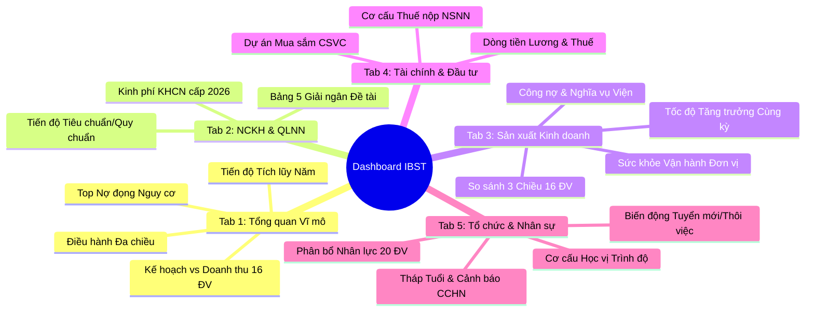

# Sổ Tay Ý Nghĩa & Hướng Dẫn Khai Thác Biểu Đồ Dashboard Quản Trị IBST ERP

> **Cơ quan ban hành**: Viện Khoa học Công nghệ Xây dựng (IBST)  
> **Phiên bản**: 2.0 (Cập nhật đồng bộ theo Bảng lương T9/2026 & Quy chế 2815/QĐ-VKH)  
> **Đối tượng sử dụng**: Ban Giám đốc Viện, Lãnh đạo các Phòng chức năng, Lãnh đạo các Viện chuyên ngành, Phân viện, Trung tâm và Công ty trực thuộc.

---

## 🎯 Mục Tiêu Của Tài Liệu
Dashboard Quản trị IBST ERP được thiết kế theo triết lý **"Dữ liệu phục vụ Chỉ đạo Điều hành tức thời" (Real-time Executive Intelligence)**. Hệ thống chuyển đổi hàng chục nghìn chứng từ hợp đồng, thanh toán, đề tài KHCN, nhân sự và báo cáo tài chính thành các mô hình trực quan hóa sắc nét.

Tài liệu này giải thích chi tiết:
1. **Nguồn gốc dữ liệu & Công thức tính toán** của từng biểu đồ.
2. **Ý nghĩa quản trị (Management Insight)**: Ban Lãnh đạo nhìn vào biểu đồ để thấy được điều gì?
3. **Dấu hiệu cảnh báo & Khuyến nghị hành động (Action Trigger)**: Khi số liệu biến động bất thường thì cần chỉ đạo phòng ban nào xử lý?

---



---

## PHẦN 1: TAB TỔNG QUAN ĐIỀU HÀNH VĨ MÔ (`OverviewTab`)

### 1.1. Biểu đồ Tiến độ Tích lũy Vĩ mô so với Mục tiêu Năm (`MacroProgressChart`)
- **Vị trí**: Nằm tại trung tâm hàng 1 Tab Tổng quan.
- **Dạng biểu đồ**: `ComposedChart` — Miền diện tích đa lớp (Area Chart) kết hợp Đường mục tiêu tuyến tính (Dashed Line).
- **Các chế độ xem**:
  1. *Ký kết lũy kế (Màu Vàng Amber)*: Tổng giá trị các hợp đồng ký mới được tích lũy từ Tháng 1 đến thời điểm hiện tại.
  2. *Doanh thu lũy kế (Màu Xanh Ngọc Emerald)*: Tổng doanh thu đã thực hiện được ghi nhận qua các kỳ thanh toán.
  3. *Dòng tiền lũy kế (Màu Xanh Dương Sky)*: Tiền thực tế đã chuyển vào tài khoản ngân hàng hoặc quỹ tiền mặt của Viện.
  4. *So sánh Ký kết vs Doanh thu*: Đặt song song cả 2 đường để đánh giá độ trễ (Lag time) từ lúc ký hợp đồng đến lúc nghiệm thu thu tiền.

#### 💡 Ý Nghĩa Quản Trị:
- **Đường chuẩn Mục tiêu tuyến tính**: Được tính bằng công thức $\frac{750 \text{ tỷ}}{12} \times \text{Tháng hiện tại}$.
- **Khoảng cách giữa Ký kết và Doanh thu**: Cho biết "gối đầu công việc" của Viện. Nếu đường Ký kết nằm cao vượt trội so với đường Doanh thu, chứng tỏ khối lượng công việc ký được rất dồi dào, bài toán của Viện lúc này là năng lực thi công và nghiệm thu để chuyển hóa thành doanh thu.
- **Tại thời điểm T9/2026**: Ký kết đạt **941,74 tỷ VNĐ (126% KH cả năm)**, vượt kế hoạch trước 4 tháng. Doanh thu lũy kế đạt **547,00 tỷ VNĐ**, bám sát kịch bản tăng trưởng cao.

#### ⚠️ Dấu Hiệu Cần Hành Động:
- Nếu đường *Doanh thu lũy kế* cắt xuống dưới đường *Mục tiêu tuyến tính*: Cảnh báo nguy cơ không hoàn thành chỉ tiêu Bộ Xây dựng giao, cần triệu tập cuộc họp đôn đốc nghiệm thu các gói thầu dở dang.

---

### 1.2. Biểu đồ Điều hành Lãnh đạo Đa chiều (Executive Multidimensional Chart)
- **Vị trí**: Nằm tại hàng 2 Tab Tổng quan.
- **Dạng biểu đồ**: `ComposedChart` / `BarChart` chuyển đổi linh hoạt 3 góc nhìn quản trị:
  1. *Biến động tháng*: Cột Ký mới + Cột Doanh thu + Đường Dòng tiền về + Đường Chi phí Quỹ lương.
  2. *Cùng kỳ 2025 - 2026*: Đặt cạnh nhau số liệu từng tháng của năm 2025 và 2026 để nhìn rõ gia tốc phát triển.
  3. *5 Khối đơn vị*: So sánh Kế hoạch - Doanh thu - Nợ đọng của: Khối Viện chuyên ngành, Khối Phân viện, Khối Trung tâm, Khối Doanh nghiệp, và Khối Phòng chức năng.

#### 💡 Ý Nghĩa Quản Trị:
- **Cân đối Dòng tiền & Quỹ lương**: Đảm bảo đường Dòng tiền về (màu xanh dương) luôn nằm cao hơn đường Quỹ lương (màu đỏ). Quỹ lương Viện dao động từ 6,5 – 8,2 tỷ/tháng. Nếu tháng nào dòng tiền về sụt giảm dưới 20 tỷ, nguy cơ căng thẳng thanh khoản sẽ xuất hiện.
- **Đỉnh cao điểm mùa vụ**: Dữ liệu cho thấy Tháng 6 và Tháng 9 là 2 đợt cao điểm nghiệm thu quyết toán của các chủ đầu tư xây dựng (Dòng tiền T6 đạt 96,7 tỷ, T5 đạt 91,0 tỷ).

---

### 1.3. Biểu đồ Kế hoạch & Doanh thu 16 Đơn vị (`UnitPerformanceChart`)
- **Vị trí**: Nằm bên trái hàng 3 Tab Tổng quan.
- **Dạng biểu đồ**: `ComposedChart` — Cột màu sắc riêng biệt cho từng đơn vị + Đường Line màu xanh cyan biểu diễn Kế hoạch giao đầu năm.

#### 💡 Ý Nghĩa Quản Trị:
- Giúp Viện trưởng đánh giá ngay lập tức: **Đơn vị nào đang "gánh đội" và đơn vị nào đang "hụt hơi"**.
- Cột Doanh thu vượt lên trên chấm tròn Kế hoạch: Đã hoàn thành vượt mức kế hoạch năm (Ví dụ: `VĐKT` đạt 173%, `PVMN` đạt 100%, `TTTBXD` đạt 152%, `TTQT` đạt 186%).
- Cột Doanh thu nằm thấp hơn nhiều so với chấm Kế hoạch: Cần rà soát cơ chế khoán hoặc hỗ trợ tiếp cận dự án lớn (Ví dụ: `PVMT` đạt 19%, `VBT` đạt 57%).
- **Tương tác**: Nhấp chuột trực tiếp vào bất kỳ cột nào để mở SlidePanel danh sách chi tiết các hợp đồng thực tế của đơn vị đó.

---

### 1.4. Bảng Cảnh Báo Nợ Đọng: Top Đơn Vị Nguy Cơ Cao (`TopDebtsTable`)
- **Vị trí**: Nằm bên phải hàng 3 Tab Tổng quan.
- **Ý nghĩa**: Phân rã số liệu nợ thành 2 đại lượng sống còn theo Quy chế 2815:
  1. *Tổng nợ khách hàng nợ Đơn vị*: Khối lượng đã làm, đã xuất hóa đơn nhưng chủ đầu tư chưa thanh toán.
  2. *Nợ Nghĩa vụ Viện*: Số tiền đơn vị phải trích nộp về tài khoản chung của Viện (chi phí quản lý, quỹ phát triển sự nghiệp, thuế) nhưng đơn vị đang nợ lại Viện.
- **Hành động**: Nút "Đôn đốc" mở thẳng danh bạ hợp đồng nợ kèm số điện thoại chủ trì để chỉ đạo thu hồi công nợ trước kỳ quyết toán cuối năm.

---

## PHẦN 2: TAB NCKH & PHỤC VỤ QUẢN LÝ NHÀ NƯỚC (`ScienceTab`)

### 2.1. Biểu đồ Phân bổ Kinh phí KHCN cấp 2026
- **Vị trí**: Hàng 1 Tab NCKH.
- **Dạng biểu đồ**: `BarChart` cột đứng đa sắc.
- **Nguồn dữ liệu**: Bảng `de_tai` kết hợp Quyết định phân bổ ngân sách khoa học công nghệ năm 2026 của Bộ Xây dựng.

#### 💡 Ý Nghĩa Quản Trị:
- Phản ánh mức độ đóng góp khoa học công nghệ cốt lõi của các đơn vị. Các đơn vị nhận kinh phí nghiên cứu lớn nhất gồm:
  + Viện Kết cấu (`VKC`): 9,345 tỷ VNĐ (13 nhiệm vụ).
  + Viện Địa kỹ thuật (`VĐKT`): 3,645 tỷ VNĐ (16 nhiệm vụ).
  + Viện Bê tông (`VBT`): 3,041 tỷ VNĐ (16 nhiệm vụ).
- Đảm bảo định hướng của Viện: **Kết hợp hài hòa giữa NCKH đỉnh cao và Dịch vụ tư vấn ứng dụng thực tế**.

---

### 2.2. Bảng 5: Tiến độ Thực hiện & Tỷ lệ Giải ngân Nhiệm vụ KHCN
- **Ý nghĩa**: Giám sát dòng tiền giải ngân ngân sách nhà nước cấp.
- **Các cột phân tích**:
  - *Giá trị HĐ (Tỷ)*: Dự toán toàn bộ vòng đời đề tài.
  - *KP cấp 2026 (Tỷ)*: Hạn mức vốn NSNN thực cấp trong năm tài chính 2026.
  - *Giải ngân chủ trì (Tỷ)*: Số tiền các chủ nhiệm đề tài đã thực hiện giải ngân thanh quyết toán chứng từ.
  - *Tỷ lệ giải ngân (%)*: Đánh dấu màu Xanh (> 50%), Vàng (> 0%), Xám (Chưa giải ngân).
- **Khuyến nghị**: Các đề tài có tỷ lệ giải ngân 0% vào quý 3 cần bị đôn đốc gấp, tránh bị Bộ Xây dựng thu hồi hạn mức vốn cuối năm.

---

### 2.3. Thước Đo Tiến Độ Tiêu Chuẩn & Quy Chuẩn Cốt Lõi
- Giám sát tiến độ hoàn thành các Quy chuẩn kỹ thuật quốc gia (QCVN 06 về An toàn cháy, QCVN 04 về Nhà chung cư, QCVN 02 về Số liệu tự nhiên) và hệ thống Tiêu chuẩn thiết kế kết cấu (TCVN 5574, TCVN tiêu chuẩn Eurocode).

---

## PHẦN 3: TAB SẢN XUẤT KINH DOANH & THIẾT BỊ KỸ THUẬT (`BusinessTab`)

### 3.1. Bảng Tổng Hợp Giá Trị Ký HĐKT 16 Đơn Vị (10 Cột Chuẩn Báo Cáo Giao Ban)
- **Vị trí**: Đầu Tab Kinh doanh.
- **Tính năng nổi bật**:
  - Chuyển đổi linh hoạt giữa 2 hệ đơn vị: **Tỷ VNĐ** (phù hợp tổng quan Lãnh đạo) và **Nghìn đồng** (chuẩn kế toán chi tiết).
  - Tích hợp nút **Xuất Excel** và **In ấn** trực tiếp phục vụ phòng họp.

| Cột số liệu | Ý nghĩa & Cách đọc |
|:---|:---|
| **Đăng ký KH năm** | Chỉ tiêu hợp đồng kinh tế Ban Giám đốc giao cho đơn vị đầu năm. |
| **SL Cùng kỳ 2025** | Số liệu ký hợp đồng tại cùng thời điểm năm 2025 để so sánh tăng trưởng. |
| **Viện ký** | Hợp đồng do Lãnh đạo Viện trực tiếp ký, giao đơn vị thực hiện (Chiếm 27,7%). |
| **Đơn vị ký** | Hợp đồng do Trưởng đơn vị được ủy quyền chủ động khai thác và ký kết (Chiếm 72,3%). |
| **Tổng ký 2026** | Tổng cộng giá trị ký kết = Viện ký + Đơn vị ký. |
| **So KH năm (%)** | Tỷ lệ hoàn thành kế hoạch năm (> 100% là vượt chỉ tiêu). |
| **So Cùng kỳ (%)** | Tốc độ tăng trưởng so với năm ngoái (> 100% là tăng trưởng dương). |

---

### 3.2. Biểu đồ So sánh 3 Chiều & Cột Xếp Chồng (Stacked Comparison Chart)
- **Thiết kế đồ họa**:
  - Cột Kế hoạch (Màu Vàng).
  - Cột Cùng kỳ năm trước (Màu Xám).
  - Cột Thực hiện năm nay được **xếp chồng 2 màu**: Phần dưới là **Đơn vị ký** (Xanh ngọc) và phần trên là **Viện ký** (Xanh dương).
- **Ý nghĩa quản trị**: Phản ánh mức độ độc lập, năng động của từng đơn vị trong cơ chế tự chủ. Đơn vị nào có phần màu xanh ngọc càng cao chứng tỏ đơn vị đó có uy tín thương hiệu mạnh, khách hàng tự tìm đến mà không phụ thuộc vào nguồn việc của cơ quan Viện.

---

### 3.3. Biểu đồ Tốc Độ Tăng Trưởng so với Cùng Kỳ (Horizontal Bar Chart)
- **Đặc điểm**: Trục tung là danh sách đơn vị, trục hoành là tỷ lệ % tăng trưởng, có **đường ranh giới màu đỏ tại mốc 100%**.
- **Ý nghĩa**:
  - Cột vượt sang bên phải vạch đỏ: Đơn vị tăng trưởng dương (Ví dụ: `PVMN` 255%, `VĐKT` 238%, `CTCP` 228%, `TTQT` 169%, `TTTBXD` 157%).
  - Cột thụt lùi bên trái vạch đỏ: Đơn vị sụt giảm việc làm so với cùng kỳ năm ngoái (Ví dụ: `PVMT` 22%, `TTAT` 58%, `TTTK` 65%). Ban Giám đốc cần có chuyên đề hỗ trợ thị trường cho các đơn vị này.

---

### 3.4. Ma Trận Phân Tích Công Nợ & Rủi Ro 16 Đơn Vị
- Cung cấp 2 chế độ hiển thị:
  1. *Biểu đồ Cột đứng*: Hiển thị đường kẻ cảnh báo **Ngưỡng nợ cao (> 15 tỷ VNĐ)**. Đơn vị nào có cột vượt qua vạch đỏ này thuộc diện phải kiểm soát đặc biệt về dòng tiền.
  2. *Ma trận phân loại rủi ro*: Tự động gắn nhãn 4 cấp độ:
     - 🚨 **Rất cao** (Nợ $\ge 20$ tỷ): Cần thành lập tổ thu hồi công nợ do Lãnh đạo Viện chỉ đạo.
     - ⚠️ **Cảnh báo** (Nợ từ $15 - 20$ tỷ): Tạm dừng ký mới nếu chưa thanh quyết toán dứt điểm các HĐ cũ.
     - 🟡 **Theo dõi** (Nợ từ $10 - 15$ tỷ): Đôn đốc theo lịch giao ban 2 tuần/lần.
     - 🟢 **An toàn** (Nợ $< 10$ tỷ): Hoạt động thu hồi công nợ lành mạnh.

---

## PHẦN 4: TAB TÀI CHÍNH & ĐẦU TƯ (`FinanceTab`)

### 4.1. Biểu đồ Biến động Chi Lương, Nộp Thuế & Dòng Tiền
- **Vị trí**: Trung tâm Tab Tài chính.
- **Ý nghĩa quản trị**:
  - Giúp Kế toán trưởng và Ban Giám đốc kiểm soát **an toàn ngân sách**.
  - Tổng số nộp ngân sách nhà nước lũy kế đạt **34,64 tỷ VNĐ** (Thuế GTGT chiếm phần lớn, tiếp đến là Thuế TNDN và Thuế TNCN của người lao động).
  - Quỹ lương toàn Viện được bảo đảm chi trả đúng hạn hàng tháng với mức bình quân **19,9 triệu đồng/người/tháng**, nâng cao đời sống cán bộ khoa học.

### 4.2. Biểu đồ Cơ cấu Nộp Thuế (Donut Chart)
- Thể hiện tỷ trọng đóng góp nghĩa vụ với Nhà nước: Thuế GTGT là chỉ báo cho khối lượng công việc hoàn thành xuất hóa đơn; Thuế TNDN là chỉ báo cho hiệu quả lợi nhuận sau chi phí; Thuế TNCN là chỉ báo cho mức thu nhập tăng thêm của đội ngũ chuyên gia.

---

## PHẦN 5: TAB TỔ CHỨC & NHÂN SỰ (`PersonnelTab`)

### 5.1. Biểu đồ Cơ cấu Trình độ & Học vị (Donut Chart)
- **Số liệu chuẩn hóa**: Tính trên toàn bộ **647 cán bộ** thuộc 20 đơn vị Viện IBST.
  - **Tiến sĩ / TSKH**: 7 cán bộ (Chuyên gia đầu ngành cấp Quốc gia).
  - **Thạc sĩ**: 27 cán bộ (Lực lượng chủ trì kỹ thuật, nghiên cứu nòng cốt).
  - **Kỹ sư / Kiến trúc sư**: 550 cán bộ (Lực lượng trực tiếp thực chiến tại hiện trường, phòng thí nghiệm).
  - **Cử nhân & Khác**: 63 cán bộ (Khối quản lý hành chính, kế toán, bảo vệ, hỗ trợ).
- **Ý nghĩa**: Đảm bảo cấu trúc nhân lực hình tháp vững chắc: Khối kỹ sư chiếm 85% tổng quân số, tỷ lệ nhân lực trình độ cao (TS & ThS) tập trung tại các vị trí Viện trưởng, Trưởng phòng chuyên môn.

---

### 5.2. Biểu đồ Phân Bổ Nhân Lực 10 Đơn Vị Đông Quân Số Nhất
- So sánh tương quan quy mô nhân sự và tỷ lệ TS/ThS giữa các đơn vị.
- Giúp lãnh đạo điều chuyển, biệt phái chuyên gia giữa các viện chuyên ngành khi có các dự án đặc biệt lớn (như Sân bay Long Thành, Đường sắt tốc độ cao, Trung tâm dữ liệu quốc gia).

---

### 5.3. Biểu đồ Biến Động Nhân Sự (Tuyển mới vs Nghỉ việc)
- **Tăng ròng**: Trong năm tuyển mới **63 cán bộ trẻ** và tinh giản **20 lao động dôi dư/nghỉ hưu** $\rightarrow$ Tăng ròng **+43 cán bộ**.
- **Định hướng**: Thể hiện rõ chiến lược "Trẻ hóa đội ngũ - Nâng cao chất lượng chuyên môn - Thu hút nhân tài công nghệ vật liệu và kết cấu".

---

### 5.4. Tháp Độ Tuổi & Tỷ Lệ Giới Tính
- Phân khúc độ tuổi:
  - `< 30 tuổi` (18%): Đội ngũ kế cận, giàu nhiệt huyết, tiếp cận công nghệ số (BIM, AI).
  - `30 - 45 tuổi` (45%): Lực lượng nòng cốt, kinh nghiệm thực chiến dày dạn, chủ trì các hợp đồng lớn.
  - `46 - 55 tuổi` (25%): Chuyên gia cố vấn, tham gia các hội đồng nghiệm thu cấp Nhà nước.
  - `> 55 tuổi` (12%): Cố vấn cao cấp, bảo tồn tri thức khoa học viện.
- Tỷ lệ giới tính: **89% Nam / 11% Nữ** phản ánh đúng đặc thù lao động kỹ thuật xây dựng, khảo sát hiện trường, khoan địa chất và thí nghiệm tải trọng nặng.

---

### 5.5. Bảng Cảnh Báo Chứng Chỉ Hành Nghề Xây Dựng (CCHN)
- **Căn cứ pháp lý**: Nghị định 15/2021/NĐ-CP và Nghị định 35/2023/NĐ-CP quy định điều kiện năng lực hoạt động xây dựng.
- **Ý nghĩa cảnh báo**: Tự động lọc các cán bộ có chứng chỉ hành nghề (Thiết kế, Giám sát, Kiểm định, Quản lý dự án) sắp hết hạn trong vòng **90 ngày**.
- **Hành động bắt buộc**: Phòng TCHC thông báo cho cán bộ làm hồ sơ sát hạch gia hạn trước 60 ngày để tránh tình trạng hợp đồng bị đối tác xuất toán do chứng chỉ chủ trì hết hiệu lực.

---

## 📋 BẢNG TỔNG HỢP MÀU SẮC & QUY ƯỚC HIỂN THỊ (DESIGN SYSTEM)

| Màu sắc | Mã màu | Ý nghĩa trên Dashboard |
|:---|:---:|:---|
| 🔵 **Primary (Xanh Viện)** | `#00668c` / `#0ea5e9` | Ký kết hợp đồng, chỉ tiêu chiến lược, Viện ký |
| 🟢 **Success (Xanh lá)** | `#10b981` | Doanh thu thực hiện, vượt kế hoạch, an toàn |
| 🔴 **Danger (Đỏ hồng)** | `#ef4444` / `#f43f5e` | Tổng nợ đọng, hợp đồng quá hạn, sự cố tư pháp |
| 🟠 **Warning (Vàng cam)** | `#f59e0b` | Nợ nghĩa vụ Viện, tiến độ cần theo dõi, cảnh báo CCHN |
| 🟣 **Accent (Tím)** | `#8b5cf6` | Trình độ Tiến sĩ / Thạc sĩ, đề tài cấp Bộ, công tác Đảng |
| ⚪ **Subtle / Neutral (Xám)** | `#94a3b8` | Kế hoạch mục tiêu, số liệu cùng kỳ năm trước |

---

## 🚀 QUY TRÌNH SỬ DỤNG DASHBOARD TRONG CUỘC HỌP GIAO BAN

```
BƯỚC 1: Chọn Kỳ & Năm cần họp trên Thanh Bộ Lọc (VD: "Năm 2026" + "6 Tháng" hoặc "9 Tháng")
   │
BƯỚC 2: Nhấn biểu tượng "Phóng to" (Maximize) để kích hoạt "Chế độ Trình chiếu Giao ban" (Meeting Mode)
   │
BƯỚC 3: Điểm nhanh 5 Thẻ KPI Vĩ mô & Banner Lũy kế Ký kết (941,74 tỷ)
   │
BƯỚC 4: Rà soát Biểu đồ Kế hoạch & Doanh thu 16 Đơn vị → Nhấp mở Drilldown các đơn vị chậm tiến độ
   │
BƯỚC 5: Chuyển sang Tab Kinh doanh → Bật "Ma trận Rủi ro Nợ đọng" → Chỉ đạo đôn đốc các đơn vị nợ > 15 tỷ
   │
BƯỚC 6: Nhấn "Xuất Báo cáo Excel" hoặc "In trang" để lưu trữ hồ sơ biên bản giao ban Lãnh đạo
```

---
*Tài liệu được lưu trữ chính thức tại kho tài liệu dự án IBST ERP: `docs/y-nghia-bieu-do-dashboard.md`.*
